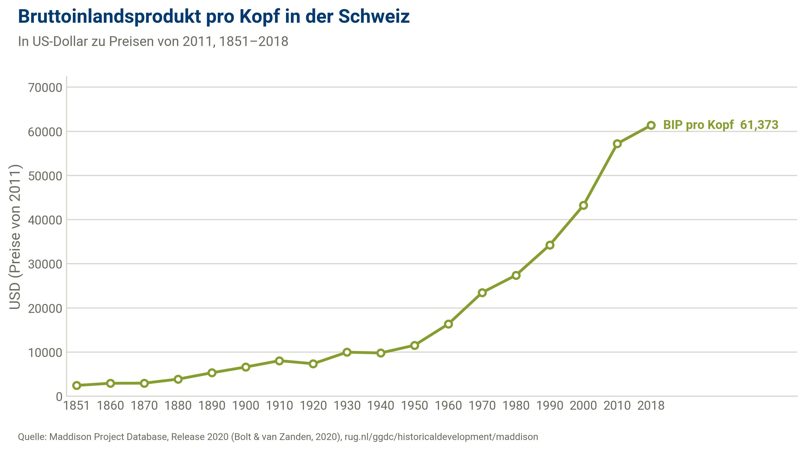
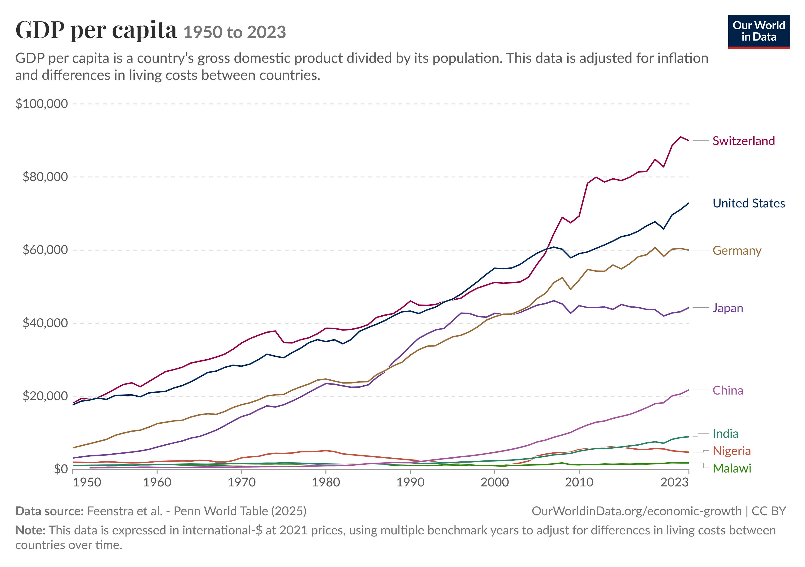
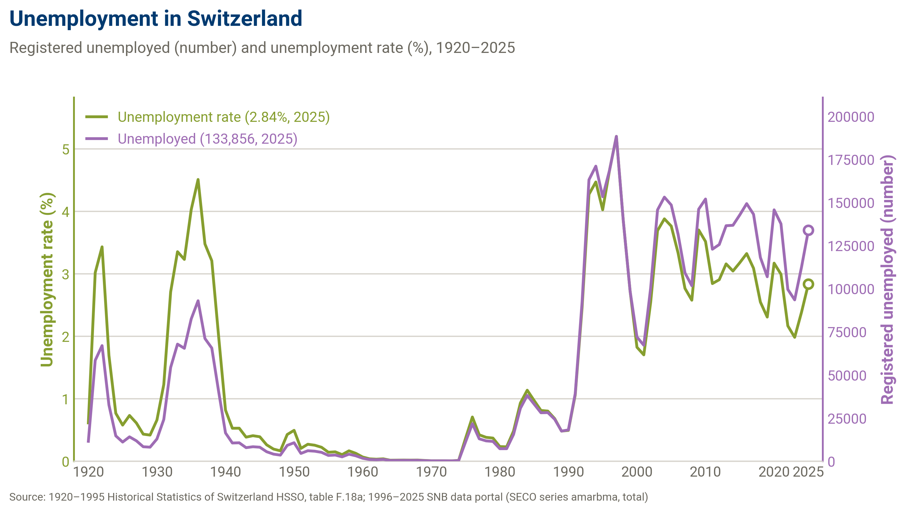
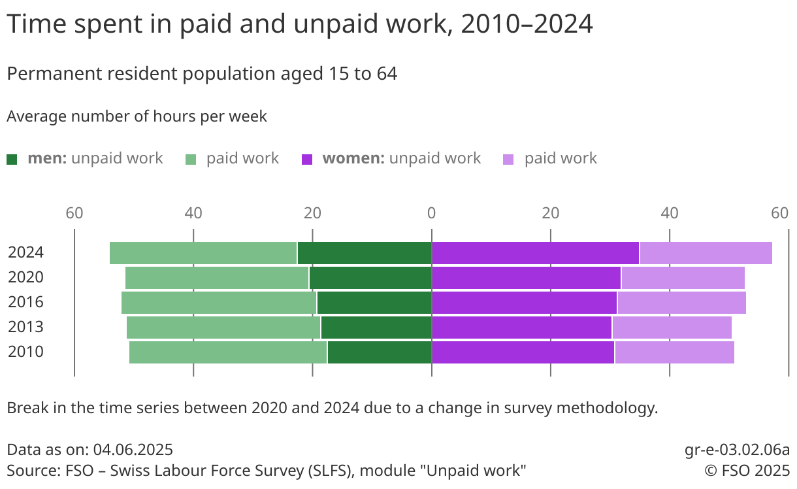
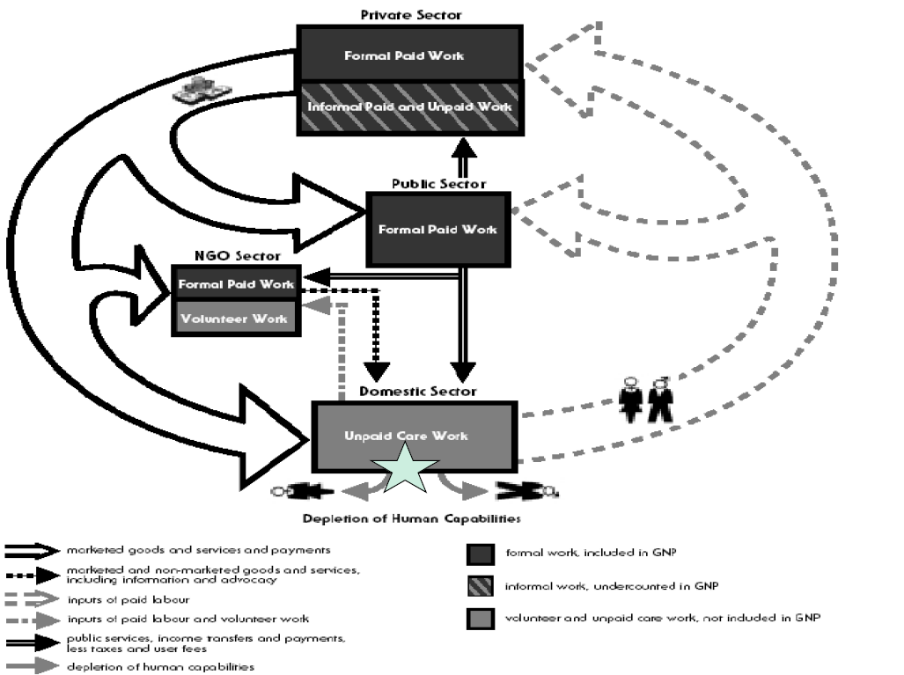
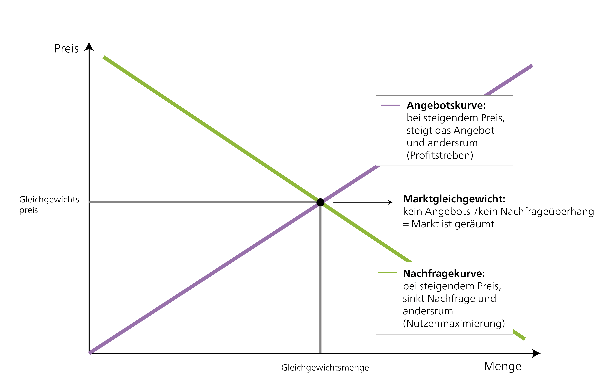
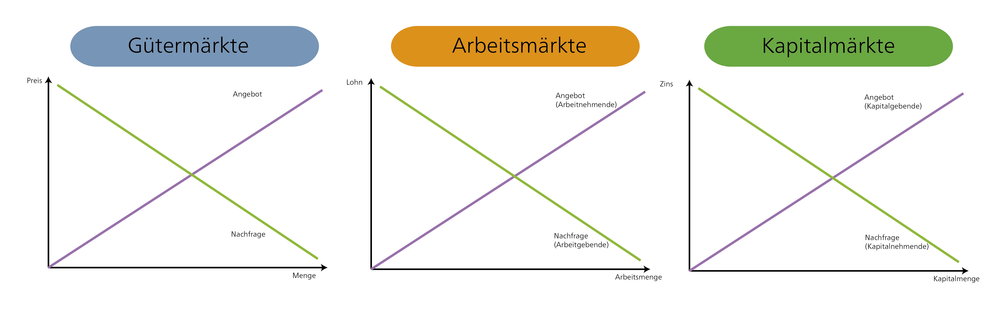
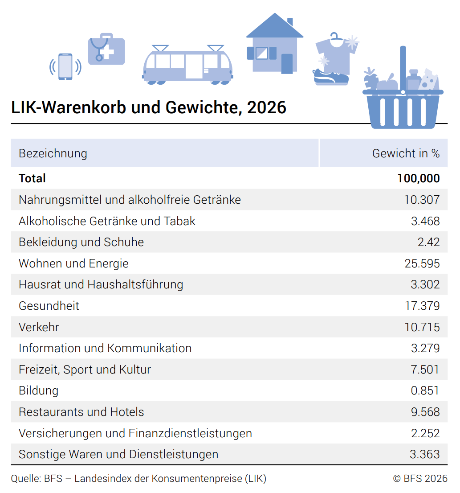

As we discussed in the previous chapter, economics can be defined in two ways: through an analytical approach (as the mainstream does) or through a subject matter -- that is, through *what* economics deals with in terms of content. In this chapter, we approach the subject matter and ask concretely: What is actually the object that economics studies?

You will find that even basic questions -- such as "What is work?" -- are answered differently. The reason is that, depending on one's understanding of the economy, one also understands its individual aspects differently. As introduced above, we therefore distinguish different schools of thought in economics. Each of these schools of thought brings its own understanding of the economy and accordingly looks at economic questions differently.

To approach the scope of economics, we follow a simple means-end logic: we begin with the *goal* of economic activity -- prosperity -- and then ask *with what* (resources, production) and *how* (market or economic system) this goal is achieved. This chapter is accordingly structured as follows:

- **Prosperity in a changing world:** What is the goal of economic activity -- what do we understand by prosperity?

- **Forms of provision in the economy:** What is needed for this prosperity to arise in the first place?

  - (Re)production factors: What is needed for goods and services to come into being?

  - Land -- Can we replace nature with technology at will?

  - Capital -- Why do some people own capital and others do not -- and how does it differ from money?

  - Labour -- Why do I earn as much as I do -- and why is some work, such as care work, often not paid at all?

  - Types of goods: Is the sun a public good -- and which properties determine how a good is treated economically?

  - External effects: Why does a flight often cost less than a train ride -- even though it harms the environment much more?

- **Abstract markets or capitalist production system:** How is it coordinated who uses these resources and how, and who receives the result?

  - The neoclassical perspective: Does anyone need to steer the economy at all -- or does it regulate itself?

  - The political-economy perspective: Who actually determines the rules of the market -- and in whose interest?

  - What is capitalism? -- What actually makes an economic system capitalist?

  - Why do companies (and entire economies) actually have to grow constantly?

  - Are financial crises accidents -- or built into the system?

::: {.callout-note .guiding-question collapse="true"}
#### Overarching guiding question of this chapter

How does a society ensure at all that the needs of its members are met?
:::

We are aware that, for students without a background in economics, there are many new terms. The aim of this chapter is therefore not that you know all topic areas in detail afterwards but rather that you gain a solid overview of the scope of economics. For students of economics, the chapter serves at the same time as a review and as a broader contextualization of existing knowledge.

:::::: {.content-visible when-format="html"}
::::: self-study-phase
::: self-study-phase-header
Self-study phase
:::

::: self-study-phase-body
Several in-depth questions are listed for each subsection. On the one hand, these serve to check your own knowledge of the respective area; on the other hand, they are also meant to prompt thought and reflection. If questions remain open on individual contents, or if you need a more in-depth engagement, you can use the [forum for questions and discussions on the content](https://ilias.unibe.ch/go/frm/3803444){target="_blank"}. Here, students can support one another during the self-study phase, and the lecturers have the opportunity to answer questions for all course participants together. You are also welcome to use the office hours on 1 October 2026 for questions and a deeper engagement. Please register for them via ILIAS by 30 September at 23:55. Of course, questions and thoughts can also be discussed in the in-person sessions.
:::
:::::
::::::

::: {.content-visible when-format="pdf"}
```{=latex}
\begin{selfstudyphase}
Several in-depth questions are listed for each subsection. On the one hand, these serve to check your own knowledge of the respective area; on the other hand, they are also meant to prompt thought and reflection. If questions remain open on individual contents, or if you need a more in-depth engagement, you can use the forum for questions and discussions on the content. Here, students can support one another during the self-study phase, and the lecturers have the opportunity to answer questions for all course participants together. You are also welcome to use the office hours on 1 October 2026 for questions and a deeper engagement. Please register for them via ILIAS by 30 September at 23:55. Of course, questions and thoughts can also be discussed in the in-person sessions.
\end{selfstudyphase}
```
:::

## Prosperity in a Changing World

*↗ Textbook chapter 3*

::: {.callout-note .guiding-question}
#### Guiding question

What is the goal of economic activity -- what do we understand by prosperity?
:::

When we ask about the scope of economics, we inevitably encounter the question of its goal: What is the purpose of economic activity in the first place? An obvious but incomplete answer is: to create prosperity. But what exactly is meant by "prosperity"?

At least in Western societies, prosperity is often understood materially, that is, as how much money we have and what things we can afford with it. But prosperity could just as well include life expectancy, education, social relationships, leisure time, an intact environment, or subjective well-being. Depending on how prosperity is defined, what counts as "good" economic development also changes. This question is thus anything but neutral: it implicitly determines what a society should strive for in the first place.

Because prosperity is so multifaceted, its measurement is correspondingly difficult and contested. The most widespread index for measuring prosperity to this day is gross domestic product (GDP). It is omnipresent in everyday life, in politics, and in the media and is regarded in many places as the most important economic indicator of all. In what follows, we therefore first look at what GDP actually measures -- and what it does not.

### Gross domestic product (GDP) as an indicator of (material) prosperity

GDP is regarded as the main indicator of a nation's prosperity. It measures the total value of all goods and services produced in a country within a year, after deduction of all intermediate inputs. The concept of GDP in its current form was developed only in the 1930s -- first attempts to measure a country's prosperity go back to the work of William Petty in the 17th century -- to combat the Great Depression and to plan armaments spending in the Second World War in the USA and England [@schmelzerDegrowthPostwachstum2019, pp. 57-59]. A precondition for this was also the invention of the "economy" as a separate sphere of social life that can be statistically recorded and measured [@schmelzerDegrowthPostwachstum2019, p. 57]. Despite its present widespread use, GDP is also constantly criticized. Even economists who advanced the development of GDP warned against using GDP as a general measure of prosperity. Simon Kuznets (1901-1985), one of the most prominent economists in this field, said: *"However one may use them, such figures \[…\] seem very useful; they seem to measure and make comparable something clearly defined and significant. But on closer inspection, it turns out that the impression that such estimates are clear and unambiguous is deceptive."* [our translation of @lepeniesMachtZahlPolitische2013, p. 90]

This warning can be made concrete through several central points of criticism -- which ultimately all show how far GDP is from the broader notion of prosperity we outlined at the outset:

- GDP records only what is traded for money. Unpaid care work or undeclared work remains invisible.

- GDP says little about actual well-being, since it is reduced purely to material possessions.

- Social and ecological consequences of economic activity are ignored -- environmental pollution does not appear as a cost in GDP. Paradoxically, a natural disaster can even raise GDP if its reconstruction has to be financed. Personal accidents, too, raise GDP through medical treatment, although they clearly worsen the well-being of the person affected.

- The distribution of income remains unaccounted for: a high GDP says nothing about whether this prosperity is distributed fairly.

- GDP is based on annual growth rates, which favours short-term thinking -- at the expense of long-term sustainability goals.

In this excerpt from an [Arte documentary on economic growth (minutes 6:57-11:51)](https://www.youtube.com/watch?t=417&v=2Kl69bWbXnY&themeRefresh=1){target="_blank"}, the economists Irmi Seidl and Nils aus dem Moore illustrate the points of criticism of GDP set out here.

@fig-GDP-CH shows how GDP per capita in Switzerland has developed over the last 150 years. It becomes apparent that GDP in Switzerland rose sharply above all in the post-war period. @fig-GDP-CH-comparison shows the development of Switzerland's GDP in comparison with selected other countries over the last 70 years.

{#fig-GDP-CH}

{#fig-GDP-CH-comparison}

### Alternative indicators of prosperity

If GDP screens out so many facets of prosperity -- how could prosperity be captured instead? In view of the limitations mentioned, several alternative indicators have been developed that aim to paint a more comprehensive picture:

The **Human Development Index (HDI)** supplements GDP with life expectancy and level of education. The HDI thus follows a concept of prosperity and human well-being according to which people should be enabled to lead a life worth living according to their own ideas. In Chapter 3.2.2 (*Justice and inequality*), we go into this approach in more detail.

The **Genuine Progress Indicator (GPI)** goes further: besides positive factors, it also includes negative ones such as environmental pollution and social inequality -- in total about 26 indicators from the economic, social, and ecological dimensions, including the value of unpaid work.

Since it is fundamentally difficult or even impossible to measure prosperity, these indicators, too, are criticized for their limitations, and accordingly many further indicators exist for measuring a country's prosperity. Besides GDP, however, none has so far been able to establish itself.

{target="_blank"}.](images/fig2.png)

To illustrate how far different indicators can diverge, @fig-gpi-gdp shows the calculations by @kubiszewskiGDPMeasuringAchieving2013 for the development of GDP and GPI per capita since the 1950s for a group of 17 countries.

![GPI vs. GDP per capita. Source: Own illustration with data from @kubiszewskiGDPMeasuringAchieving2013 [p. 63].](images/fig3.png){#fig-gpi-gdp}

### Economic growth

*↗ Textbook chapter 4*

If prosperity is mostly measured by GDP, then the *increase* in this prosperity over time -- economic growth -- almost automatically becomes the central political goal. Economic growth refers to the increase in a country's economic output over time, usually measured by the development of GDP. It is the central target variable for politics, society, and the economy -- so central that @schmelzerDegrowthPostwachstum2019 [pp. 62-68] speak of the **growth paradigm**.

Given this omnipresence of economic growth, it is astonishing that economic growth is a very young phenomenon. Only with the Industrial Revolution in England in the 19th century could sustained economic growth (measured by GDP) be observed in the world for the first time. For the longest part of human history, people lived without long-lasting economic growth. Meanwhile, economic growth is not only a central cornerstone of our current economic and social system but has developed into a compulsion [@binswangerWachstumszwangWarumVolkswirtschaft2019]. We will go into this systemic growth imperative and the growth paradigm in more detail later in the course. The significance of economic growth is intensively discussed within sustainable economics, with positions that are far apart. While some want to hold on to economic growth (in an adapted form), others advocate overcoming economic growth as a compulsion (green growth vs. post-growth). At a later point, we will engage with these discussions in depth.

@fig-hockeystick shows the development of GDP per capita for different countries or regions over the last 1,000 years. The Industrial Revolution in the 19th century is clearly visible.

{#fig-hockeystick}

::: {.callout-note collapse="true"}
#### In-depth questions

- Does GDP seem to you a sensible measure of a nation's prosperity? What speaks for it, and what against?
- Think of examples from everyday life in which the growth paradigm can be recognized.
- What could be the reasons that GDP and GPI diverge so strongly? And what could be the reason that the trends in the figure diverge only from the 1970s onwards?
:::

::: {.callout-caution collapse="true"}
#### Further reading

- Binswanger, Mathias. 2019. *Der Wachstumszwang: warum die Volkswirtschaft immer weiterwachsen muss, selbst wenn wir genug haben* [The growth imperative: why the economy has to keep growing even when we have enough]. Wiley-VCH Verlag GmbH & Co. KGaA.
- Lepenies, Philipp. 2013. *Die Macht der einen Zahl: eine politische Geschichte des Bruttoinlandsprodukts* [The power of a single number: a political history of gross domestic product]. Erste Auflage, Originalausgabe. Suhrkamp.
- Schmelzer, Matthias. 2016. *The hegemony of growth: the OECD and the making of the economic growth paradigm*. Cambridge University Press.
- Sen, Amartya. 2011. *Development As Freedom*. Knopf Doubleday Publishing Group.
:::

## Forms of Provision in the Economy

::: {.callout-note .guiding-question}
#### Guiding question

What is needed for prosperity -- as we discussed it in the last section -- to arise in the first place?
:::

For a society to achieve prosperity, it must first ensure that goods and services are provided at all. Through the division of labour, an economic system always faces fundamental questions of organization: How is societal production distributed? Who (re)produces, maintains, and repairs what? Who consumes what? In other words: How is what is necessary for prosperity produced in the first place and distributed among the members of a society?

As became clear from the preceding chapters, the answers to these questions depend strongly on which understanding of the economy one takes as a basis. Here, we follow Karl Polanyi's [-@polanyiEconomyInstitutedProcess1957a] substantivist understanding, which defines the scope of the economy beyond the market and proposes a broad understanding of the economy.

For our starting question -- what is needed for prosperity to arise -- Polanyi's broad substantivist understanding is particularly illuminating. It shows that real economies consist of very different institutions and logics. A housing cooperative works with different business models than plumbers and steel companies, the public hospital differs from the industrial firm, and unpaid care work is organized differently from assembly-line work. Karl Polanyi therefore distinguishes four socioeconomic organizing principles, or forms of provision, that can be found in actually existing economies and interact in different ways: householding, reciprocity, redistribution, and market exchange [@polanyiGreatTransformation2017]:

(1) **Householding** refers to forms of self-sufficiency and is rooted in families and households. In ancient Greece, the oikos, that is, the whole house, was an autarkic, that is, self-supplying, economic unit. But even today, a large part of the economy still takes place in the household, in particular as unpaid care, nursing, and childcare work as well as housework (for example cooking, cleaning, gardening).

(2) **Reciprocity** is based on the principle of give-and-take and defines an exchange of goods and services between persons beyond the market and the state. On the one hand, it takes place in local communities and between persons who know one another, for example among friends, in the neighbourhood, or in associations, and includes, among other things, neighbourly help and community work. On the other hand, there are also many historical examples of reciprocal exchange over long distances, in which peoples exchange goods, with ceremonial motives and motives of maintaining relationships often playing a role alongside economic ones. To endure, however, this form of provision requires that giving and taking do not get too far out of balance or are underpinned by a corresponding ideal of justice (see Chapter 3.2.2, *Justice and inequality*).

(3) **Redistribution** defines a systematic flow of resources towards an administrative centre and their subsequent redistribution. Examples are public education, health, and pension systems financed by taxes or levies. Redistribution allocates resources to members of a society (who are often unknown to one another). It takes place within political territories, in particular the nation-state, and therefore goes beyond local communities.

(4) Finally, **market exchange** defines the exchange of goods and services at market prices. This is the commodified[^2_intro-1] area of economic activity. Depending on the type of goods and services traded and on their reach and structure, these markets can differ. The logic of individual profit and ability to pay predominates in market relations.

[^2_intro-1]: Commodification means that something becomes a commodity and is traded on markets. That is, something is produced and distributed according to a market logic that previously did not work according to this logic (for example food produced for self-sufficiency). In principle, almost anything can be affected by commodification, for example labour, goods, natural resources, CO~2~, and so on. With the development of capitalism, more and more areas of the economy were commodified, which is why this appears self-evident to us in many areas.

::: {.callout-note collapse="true"}
#### In-depth questions

- Find further examples from your everyday life for each form of provision.
- Find an example of a good or service that is provided through all four forms of provision. How do the four forms of provision change the situation and the character of the transaction or provision?
:::

Back to the guiding question: prosperity thus does not arise through market exchange alone. Real economies are always **mixed economies**. They combine all four forms of provision, even if in everyday life only market exchange is often perceived as "the economy". Not every aspect of life and economic activity can -- or should -- be turned into a marketable, commodified good. Which of these forms of provision contribute how strongly to a society's prosperity (and which of them become visible in classical prosperity measures such as GDP) is thus itself a central economic question.

## (Re)production Factors

*↗ Textbook chapter 16*

::: {.callout-note .guiding-question}
#### Guiding question

What is needed for goods and services to come into being?
:::

To answer this question, economics needs a concept for the "ingredients" of economic activity: the **factors of production**. Factors of production are all the inputs that are necessary to produce an output -- a good or a service. The aggregated factors of production of an economy are called **factor endowment**. The origins of the factors of production lie in the physiocratic thinking of the 18th century; as a concept, they became established in classical economics. According to classical economics, the factors of production of economic activity can be divided into three categories: **land, capital, and labour.** Over time, this trinity has repeatedly been criticized, extended, and adapted. Further factors such as entrepreneurship, knowledge and technology, and nature itself, for example, have been brought into play. Often, however, these aspects are also subsumed under one of the three existing factors.

But the question "What is needed for something to come into being?" is thereby only half answered. Many schools of thought (such as neoclassical economics, post-Keynesian economics, and in part also Marxist economics) focus above all on the **production** of goods and services for sale on the market. What is often screened out is **reproduction** -- that is, everything that is necessary for something to continue to be usable. A bicycle, for example, has to be pumped up regularly and its chain oiled so that it rides reliably. A cup has to be washed thousands of times so that it can be used again. But people, and thus workers, also have to be "reproduced" (this is often described as social reproduction). We all need food, care, and so on in order to live and to show up for work.

Whoever focuses only on production thereby screens out a central part of what makes goods and services possible in the first place: unpaid reproductive work such as cooking, cleaning, or childcare is often not analysed but simply assumed as given. Feminist economics shows, however, that this work is an integral part of economic life. It forms the basis on which market-mediated activities can take place in the first place. The separation into "productive" market-mediated work and "unproductive" housework, and its gender-specific connotations, developed only with the emergence of capitalism and is by no means natural. Questions of production and reproduction are thus also strongly connected to the capitalist production system (see Chapter 2.5, *Abstract Markets or Capitalist Production System*).

In what follows, we turn to the three classical factors of production -- land, capital, and labour -- which, depending on the perspective, play a central role not only for production but also for reproduction.

### Land -- can we replace nature with technology at will?

*↗ Textbook chapter 13*

The factor of production land often covers not only the area or ground itself but also the natural environment. The question is often how land and natural resources are handled and how they are used. These questions affect us very directly in everyday life. The design of living space, for example, is of central importance for all of us. But how we deal with agricultural land, forests, lakes, and the living beings within them also plays a central role in our everyday lives. In addition, land and natural resources are an elementary factor for the production of goods and services. Land is indispensable for production, whether for factories or agriculture. But natural resources such as water and rare earths are also central as inputs for production.

What is special about land is that, on the one hand, it has unchangeable natural characteristics (for example land is immobile and cannot be multiplied), while, on the other hand, how it is handled is very strongly socially determined (for example rights of ownership, access, and use). This starting point means that the handling of land has a great deal of conflict potential, is necessarily linked to questions of distribution, and can also be an important aspect of inequality. Accordingly, questions about the handling of land are deeply political.

#### Perspective 1: Nature is replaceable in principle

Despite their vital importance, land and natural resources receive little attention in economics. In many schools of thought such as neoclassical economics or, in part, post-Keynesian theory, land is either screened out, assumed, or treated as a pure asset (for example housing) and thus subsumed under capital. In these theories, land very rarely finds its way into production functions. And when land and natural resources are explicitly considered, they are often understood as "ecological services" (*ecosystem services*). Through pricing, they are then conceptualized as an input factor and commodity and embedded in a market logic. In such understandings, land and natural resources are thus implicitly or explicitly understood as "pure input factors" and/or assumed as self-evident. A forest, for example, is reduced to its purely economically exploitable dimension, such as the sale of timber and game. What is often neglected is that nature is never available in the form of goods but must always be made usable and exploitable by humans through labour [@schauppStoffwechselpolitikArbeitNatur2024]. In these understandings, it is also implicitly assumed that, for example, the loss of biodiversity can be compensated by technological solutions. In a cost-benefit analysis, all costs and benefits are then summed up, and all the different aspects are thus equated through monetary valuation. For sustainable economics, such fundamental questions are of central importance. In addition, through the reference to market logic, questions of land are depoliticized, and questions of power and distribution are implicitly excluded.

#### Perspective 2: Nature has limits that technology cannot lift

In contrast, there is a fundamentally different understanding of land and natural resources as non-replaceable goods that form the basis of social life. In this understanding, the loss of biodiversity or the destruction of fertile soil cannot be compensated. These losses are final. Such understandings often come from ecological economics, but some currents of feminist and Marxist economics also build on this understanding. The natural limitedness and the need for social organization in dealing with land are taken as the starting point, and questions of power and distribution are often made explicit.

Whether nature can be replaced by technology at will is thus not a purely technical question but a theoretically and politically charged one. In Chapter 3.1, we go deeper into different understandings of nature and their consequences. What is important to take away here above all is that land, and its significance for economic life, can be understood and conceptualized in different ways. In addition, land and natural resources have some unchangeable, natural characteristics. Who has access to them, however, is not subject to any natural economic law but is the result of economic, political, and social structures.

### Capital -- why do some people own capital and others do not?

*↗ Textbook chapter 11*

We encounter capital every day in various forms, yet the term mostly hides in rather technical vocabulary. With a certain amount of start-up capital, for example, we can found a company, invest money in a capital investment (for example buying securities), or invest in our own education, which is referred to as human capital. Not least, our economic system -- capitalism -- is named after the (company) capital that empowers its owners to make the decisions that matter for the company. Accordingly, it must play an important role. But what exactly is it? The examples given already show that an important aspect is that one invests (in) something that is later supposed to yield a return (a *capital* return): by investing start-up capital, I want to build a company that later makes profits, the purchase of securities is supposed to yield regular interest, and the investment in education is supposed to pay off through a higher wage in working life. But do these examples all refer to capital to the same extent, or are there differences? Again, this question is answered differently depending on the perspective.

#### Capital as a thing -- inequality as the result of different investments

Neoclassical economics sees capital first and foremost as a factor of production, that is, mainly machines, tools, factory buildings, and so on. With this (physical) capital, goods are then produced with the help of labour as the second factor of production. On the capital market (or the market for financial capital), the rate of return is then determined, which in equilibrium corresponds to the productivity of physical capital. Capital is understood here primarily as a commodity that is traded on a market and valued and distributed according to market mechanisms. The main thought here is of the production of goods, but in this understanding human capital can very well also be understood as such. I invest time and forgo wages during my training and then expect a return in the form of a higher wage, which is regulated through the market mechanism.

This understanding fits our guiding question as follows: whoever owns more capital has invested (or inherited) more in the past. Inequality therefore appears here primarily as the result of different investment decisions and opportunities, not as a structural problem. To distinguish it from money: **money** can also be capital in this understanding, provided it is invested in order to achieve a return -- money that merely lies in a drawer would, strictly speaking, not be capital.

#### Capital as a social relation

Post-Keynesian theory, too, understands the concept of capital primarily as a factor of production but connects entirely different dynamics with it (see Chapter 2.5). In particular, a concept of capitalism and the distinction of classes are connected with it: workers who have no capital and therefore have to work for their wages, and capitalists who have capital and can deploy it to make profits. Questions of power and distribution thus also increasingly come into view.

Post-Keynesian economics took this view of the relationship between classes from Marxist economics. Marxist economics makes this relational aspect of capital the central point: capital here is not a thing but a **social relation**. The deployment of capital is based on the separation of the means of production from the workers, who have to work for a wage -- that is, sell their labour power, since they themselves have no capital. In this understanding, we do not speak of capital, for example, in the case of machines used for agricultural self-sufficiency. But if an entrepreneur buys machines and pays wage workers to till the land for them, and the harvest is sold on the market to make a profit, we speak of capital in this understanding. Capital is thus tied to the use of wage labour to make a profit, and this class relation is the central aspect of capital. The Marxist concept of capital is accordingly tied to the specific context of capitalism and cannot be extended at will to other times or contexts. The concept of human capital, too, makes little sense in this understanding. The capitalist dynamic that capital must constantly multiply (accumulation) is likewise already inherent in this concept as a social relation. In our example, the entrepreneur would then, for example, invest the profit made in further machines to expand production. This dynamic would then continue steadily.

To distinguish it from money: mere money is not yet capital in this understanding. Only when it is deployed to mobilize wage labour and make a profit from it does it become capital. @hodgsonWhatCapital2014 therefore also finds this understanding insufficient and understands capital as everything that can potentially be used to make a profit. Concretely, this means that all wealth is understood as capital, provided it can also serve as collateral for taking out loans. This understanding of capital also underlies, for example, Piketty's analysis in his major work *Capital in the Twenty-First Century* and can be connected with various schools of thought [@pikettyCapitalTwentyFirstCentury2014].

Although public debates often act as if it were entirely clear what is meant by "capital", quite different understandings appear here -- and with them different answers to our guiding question. Whether inequality in capital ownership is understood as the result of individual decisions, as a structural power relation, or as a self-reinforcing wealth advantage depends on which concept of capital we take as a basis. It is therefore central to be aware of which concept of capital we use and for what purpose.

### Labour -- why do I earn as much as I do -- and why is some work, such as care work, often not paid at all?

*↗ Textbook chapter 12*

Labour is the third factor of production and is necessary so that goods and services can be obtained from raw materials. Coordinating, mental, and executing activities are necessary for the purposeful use of capital in order to be able to produce. Labour is thus a central factor for value creation. In many cases, labour also determines people's everyday lives and takes a central role in economic policy reporting, for example through discussions of unemployment, employment figures, and minimum wages. This often concerns a specific form of labour: **paid employment.**[^2_intro-2]

[^2_intro-2]: Paid employment means activities for which people receive a direct return in the form of money.

This is precisely where our guiding question comes in: Why do some people earn a lot for their work and others little -- and why does some work count as worthy of payment at all, while other work, such as care and nursing work, often remains unpaid? As we will see, the answer depends strongly on which economic understanding of labour one follows.

#### Centrality of paid employment -- what counts as work at all

In our everyday lives, too, much revolves around paid employment. But this centrality of paid employment developed only in the course of 19th-century industrial capitalism and became the central societal instance of integration and orientation. While in premodern household economies paid and unpaid activities were closely connected and the household was the central economic unit, now only market-mediated, remunerated labour was increasingly recognized as productive, while care and housework were devalued. With the development of capitalism, more and more people became dependent on paid employment to make a living. And the capitalist system, too, depends on paid employment, since excessively high unemployment can weaken economic development and lead to a societal crisis (post-Keynesians emphasize that with low employment, aggregate demand also falls away). In addition, social security and tax revenues were built strongly on paid employment, and societal participation and social recognition also orient themselves towards paid employment. In the second half of the 20th century, this development was consolidated by the idea of the *standard employment relationship* and the male breadwinner as a societal guiding model.[^2_intro-3]

[^2_intro-3]: Following @bernetArbeitAndersDenken2021 [p. 128], the term "standard employment relationship" is understood as a "permanent, socially insured, and collectively protected full-time position with a secure monthly income, clearly regulated working hours, protection against dismissal, and certain instruments of co-determination" [our translation]. Despite its name, this employment relationship was never really normal. There were always many people who did not work under such conditions, very often migrants and women.

Since the 1970s, this model has come under increasing pressure, in Switzerland too, through the flexibilization and precarization of employment (for example the gig economy). Since the 1970s, unemployment and underemployment have risen in Switzerland, as have temporary work, part-time employment, and precarious and informal employment [@benelliWenigerWertTemporar2014; @degenArbeitUndKapital2012; @sheldonMigrationIntegrationUnd2007; @streckeisenSteigendeErwerbslosigkeitUnd2012; @streckeisenUnsichtbarenPrekaritaetZur2019]. Over the last 50 years, women have also increasingly entered the labour market but mainly work part-time.

In line with the centrality of paid employment, many schools of thought -- such as neoclassical and post-Keynesian economics -- focus strongly on paid employment, while unpaid reproductive work is mostly tacitly assumed. Feminist economics, by contrast, works with a considerably broader concept of labour that also includes unpaid work. It often draws on the so-called **third-person principle**: any activity that could in principle also be performed by a third, paid person counts as work. Cooking, cleaning, or childcare, for example, thus fall under "work" just as much as factory work, regardless of whether they are remunerated or not.

Feminist economics also points out that person-related services (for example nursing, care) follow a different logic than, say, factory work. Unlike factory work, the productivity or efficiency of person-related services can hardly be increased, because the quality of the work depends directly on time and human interaction and can therefore hardly be standardized or planned. As a result, wage costs in these areas rise relative to other sectors, since they cannot (for example through new technologies) show ever higher labour productivity, while wages rise with societal development. The economist William Baumol described this under the term *cost disease* and shows how, for example, costs in technological sectors have fallen massively while they continue to rise in person-related services. In Switzerland, this is clearly visible, for example, in the health-care system, where costs rise, calls for efficiency improvements arise but cannot be implemented, which puts staff under great pressure.

#### But how are working time and wages determined?

This brings us to the core of the guiding question: Why do *I* earn as much as I do? Here, too, the schools of thought diverge. Neoclassical economics sees the central explanation in the market mechanism of the labour market: in equilibrium, the wage corresponds to labour productivity. People maximize their personal utility by deciding, according to their preferences, on an optimal ratio between leisure and consumption, which is made possible by selling labour (time). Whoever wants to work finds work in this model too: in market equilibrium, there is no (involuntary) unemployment. From this perspective, one thus earns what corresponds to one's own productivity.

Feminist, post-Keynesian, and Marxist economists contradict this: because of the societal centrality of paid employment, people are ultimately compelled to work and cannot freely determine their working time. Power imbalances in the labour market and institutions such as trade unions play a central role in this process. In addition, feminist economics emphasizes that these questions are also often shaped by societal norms, so that the distribution of work, working time, and wages is also co-determined by questions of gender.

#### Unemployment

In line with the centrality of paid employment, often only figures on paid work are recorded and included in analyses. The most important indicator used is usually the **registered unemployment rate**. This is mostly calculated as follows:

$$\text{Unemployment rate} = \frac{\text{Number of registered unemployed}}{\text{Labour force}}$$

This indicator is only one of several indicators that are used, however. The International Labour Organization (ILO), for example, relies on unemployment in the ILO sense and, accordingly, the ILO unemployment rate (*Erwerbslosenquote*) as an indicator. All persons of the permanent resident population in Switzerland who are without work, are looking for a job, and could start an activity within a short time count as [**unemployed according to the ILO**](http://www.bfs.admin.ch/bfs/de/home/statistiken/arbeit-erwerb/erhebungen/els-ilo.html){target="_blank"}. [In 2025, the registered unemployment rate in Switzerland averaged 2.8%](https://www.admin.ch/de/newnsb/yFqP7XwYSs3ODBR8ZdR9g){target="_blank"}, and the [seasonally adjusted ILO unemployment rate in the fourth quarter of 2025 was 5.0%](https://www.bfs.admin.ch/bfs/rm/home/statisticas/catalogs-bancas-datas.assetdetail.36326600.html){target="_blank"}. Unlike the registered unemployment rate, the ILO unemployment rate also includes, for example, self-employed persons, persons affected by long-term unemployment such as those whose benefits have run out, and young people who are not yet in gainful activity directly after their training. Accordingly, the ILO unemployment rate is higher than the registered unemployment rate. Such indicators say nothing about the type of employment and employment relationships, however, so they are not useful for such an assessment. More fundamental questions about the meaning and purpose of work and of a high-employment goal also cannot be discussed with such indicators.

As with questions about working time and wages, the schools of thought also see different reasons for unemployment. In neoclassical economics, unemployment is interpreted above all as the result of market disturbances or market failure, that is, when certain factors disturb the frictionless functioning of the market mechanism. A classic example of such "market disturbances" is minimum wages above the market equilibrium, which raise costs for companies and thus lead to unemployment. If there are no disturbances in the market mechanism, there is in principle no (involuntary) unemployment. Post-Keynesian economics emphasizes above all that unemployment does not arise from the labour market but depends on economic development and aggregate demand. If the latter falls, no more people are hired or employees are dismissed, and unemployment rises. It also emphasizes, however, that full employment is not necessarily desired by employers, since a certain level of unemployment also strengthens companies' bargaining power [@kaleckiPoliticalAspectsFull1943]. Marxist economics, too, emphasizes that unemployment is a structural part of capitalism and strengthens the bargaining power of capital vis-à-vis employees [@magdoffDisposableWorkersTodays2004]. Feminist economics emphasizes that unemployment is not gender-neutral and that women are more often part of the hidden reserve who would like to do more paid work, or any paid work at all, but cannot, for example because of unpaid care work.

The following figure shows the development of the unemployment rate in Switzerland since 1920. Unemployment was and is very low in Switzerland in international comparison. Especially during the post-war economic boom, there was almost no unemployment in Switzerland, which is why Switzerland brought in many workers from abroad -- who often worked under precarious conditions [@degenArbeitUndKapital2012]. Only with the crisis of the 1970s did unemployment return to Switzerland, although Switzerland prevented a sharp rise by exporting unemployment abroad -- by 1977, almost 250,000 foreign workers had to leave the country [@degenArbeitUndKapital2012, p. 910].



#### Unpaid work

Since 1997, the Federal Statistical Office (FSO) has recorded the monetary value and the quantity of unpaid work in Switzerland every four years with the household production satellite account ([SHHP](https://www.bfs.admin.ch/bfs/de/home/statistiken/arbeit-erwerb/erwerbstaetigkeit-arbeitszeit/vereinbarkeit-unbezahlte-arbeit/satellitenkonto-haushaltsproduktion.html){target="_blank"}). In Switzerland in 2020, 9.8 billion hours were worked unpaid (mostly by women), more than were spent on paid work (7.6 billion hours). All unpaid work in 2020 is estimated at a value of CHF 434 billion. If GDP is extended by total household production, the latter corresponds to 41.4% of the value added of the extended total economy. @fig-unpaid-paid shows how paid and unpaid work are distributed between the genders. Overall, women perform somewhat more working hours per week than men; the big difference is that the majority of these are not paid.

{#fig-unpaid-paid}

The question "Why do I earn as much as I do?" thus cannot be answered by individual productivity alone. It depends on which activities count as "work" at all, on how bargaining power and institutions shape the labour market, and on which historically grown norms determine whose work is visible and remunerated. Care work often remains unpaid -- not because it would be less necessary, but because our present notion of "productive" work is historically tied to the rise of paid employment in capitalism.

::: callout-note
#### In-depth questions

- Collect two examples for each of the three factors of production.
- Collect examples of (re)production factors that are insufficiently captured in the three classical factors of production.
- Think about, using examples, how it affects production if there is more labour than capital, if there is more capital than labour, if the factor land is not available, or if all factors of production are given in balanced proportion.
:::

::: {.callout-caution collapse="true"}
#### Further material

The short documentary ["Did we toil more in the past?"](https://www.youtube.com/watch?v=krP2vuV90FU){target="_blank"} (in German) gives a rough overview of the history of work.
:::

## Types of Goods

::: {.callout-note .guiding-question}
#### Guiding question

Is the sun a public good -- and which properties determine how a good is treated economically?
:::

Production creates things and services that we humans can use and draw on. In production, we turn nature into usable things and services that serve people in satisfying their needs. But how can we describe these things and services as a category? The things and services produced are often referred to as goods, and attempts are made to describe them by their properties. It becomes apparent that these properties are often not simply inherent in the goods but are strongly shaped by societal structures. Accordingly, central questions about how goods are handled, such as access to them, cannot be reduced to the properties of goods but are always also shaped by societal negotiation.

### Properties of goods

Many schools of economic thought distinguish goods according to two central properties. *Rivalry* describes whether a good can be consumed by different people at the same time without loss of utility. The *excludability principle* describes whether it is possible to exclude persons from using a good. On the basis of the two properties, rivalry and excludability, all goods can be divided into one of four types of goods. @tbl-types-of-goods gives an overview of this distinction:

```{r}
#| label: tbl-types-of-goods
#| tbl-cap: "Types of goods by excludability and rivalry in consumption."

library(kableExtra)
is_pdf <- knitr::is_latex_output()

df <- data.frame(
  Excludability = c("Yes", "No"),
  Yes = c(
    "Private goods: bread, flat, clothes",
    "Common-pool goods: deep-sea fishing grounds, the Gotthard tunnel on Easter weekend"),
  No = c(
    "Toll goods: cable television, streaming services, national parks",
    "Public goods: legal order, river corrections, fireworks"),
  check.names = FALSE
)

df |>
  kbl(booktabs = TRUE, align = "l") |>
  kable_styling(
    bootstrap_options = c("striped", "hover", "condensed"),
    latex_options = if (is_pdf) c("hold_position") else NULL,
    full_width = !is_pdf
  ) |>
  add_header_above(c(" " = 1, "Rivalry in consumption" = 2)) |>
  column_spec(1, bold = TRUE, width = if (is_pdf) "2.5cm" else NA) |>
  column_spec(2:3, width = if (is_pdf) "5.5cm" else NA) |>
  row_spec(0, bold = TRUE)
```

**Private goods** are both excludable and rival in consumption. This means that it is possible to keep persons from consuming through measures and that the consumption of a good cannot be repeated by any number of persons. Because of these properties, private goods are characterized as well suited for trade on markets.

**Toll goods** (or club goods) are excludable but not rival in consumption. Cable television or streaming platforms, for example, can exclude persons from consumption through a subscription fee, but the consumption of the subscribers does not suffer when the number of users rises. Apart from digital goods, the separation between private goods and toll goods is more difficult. Membership in a fitness club and the use of its premises, for example, is non-rival only until everyone wants to pursue their New Year's resolutions in January and all the machines are occupied.

**Common-pool goods** (also called commons) are not excludable and yet rival in consumption. These often include natural resources such as fish stocks or the availability of water for irrigating fields. To prevent overuse of these goods, coordination between the different claims to use is indispensable.

**Public goods** are neither excludable nor rival in consumption. Because they are not excludable, such goods can hardly be traded on markets. The use of public goods without paying for them is described as the free-rider problem. Through state financing, such necessary goods can nevertheless be provided.

This puts the question from our guiding question in a new light: Is the sun -- whose light we all enjoy at the same time and without exclusion -- really necessarily a public good? Some schools of economic thought, such as ecological economics, and work from social anthropology emphasize that the classification of these goods is not a natural one. Excludability in particular is not a property inherent in the good but depends above all on technical possibilities, societal negotiation, and societal power relations. Especially in the handling of natural resources, the question of excludability is primarily a social and/or technical one. Water resources, for example, can technically be made easily accessible but also excludable. Even sunlight could theoretically be made excludable -- as Mr. Burns plans in the series *The Simpsons*, for whom [the sun is literally the enemy](https://www.youtube.com/watch?v=L3LbxDZRgA4){target="_blank"}. In this respect, the question is not so much whether the sun is a public good but whether the sun is treated as a public good. Concretely, this means that whether the sun *remains* a public good is ultimately a question of technology, power, and societal negotiation.

In categorizing goods, it should also be noted that this involves a reification. Goods are reduced to their purely economic value. This can be very problematic, especially for resources that are managed as common-pool goods. What is often screened out is how common-pool goods structure social relationships and communities, how participation takes place, and how a relationship to nature and the environment is maintained. Ugo Mattei therefore argues that it is too narrow to say that we "have" a commons. Rather, the point is to explore to what extent we "are" commons, insofar as we are also part of the environment [@matteiKurzePhanomenologieCommons2014, p. 76]. For this reason, social anthropology, for example, often speaks of the verb "commoning" instead of the noun "commons".

::: callout-tip
#### The tragedy of the commons and how to overcome it

*↗ Textbook chapter 19*

Actors cannot be excluded from the consumption of public and common-pool goods. This can result in overuse of these goods, which Garrett Hardin [-@hardinTragedyCommons1968] described as the tragedy of the commons. Privatization of these goods (so-called *enclosure*) is often put forward as a solution: through the allocation of clear property rights, actors can be excluded from use.

Elinor Ostrom researched the same topic and observed how overuse can be counteracted through self-organized cooperation within clear boundaries even without the allocation of property rights. Working solutions against the overuse of non-excludable goods are, however, strongly context-dependent and thus hard to generalize. For her research on commons, Ostrom was awarded the Nobel Memorial Prize in Economic Sciences in 2009 [@ostromMarketsStatesPolycentric2010]. Commons research, which by now is rich, knows many studied examples of commons that were not overused and did not fall victim to the tragedy. There are examples of commons that have been managed collectively and sustainably for centuries [see, for example, @dekeyzerInclusiveCommonsSustainability2018; @demoorDilemmaCommonersUnderstanding2015]. The commons research of Ostrom and others accordingly shows that there are solutions beyond privatization and nationalization for preventing the tragedy of the commons. This also fundamentally breaks up the dichotomy of market and state and opens up points of connection beyond these two spheres. In Chapter 5, we turn in more detail to the relationship between market and state.
:::

### External effects -- why does a flight often cost less than a train ride?

The price for the use of goods does not always correspond to the true societal costs. If the good is nevertheless used at this price, the costs are shifted onto third parties, that is, neither onto producers nor onto consumers but, for example, onto taxpayers, subsequent generations, or nature. If this is the case, one speaks of **external effects**.

This is exactly what answers our guiding question: a flight ticket is often cheaper than a train ride because many of the actual costs, such as climate damage from CO~2~ emissions, are not included in the flight price at all. These costs are borne instead by third parties. The market price thus does not reflect the full societal costs. External effects need not be only negative, as in this example, however; they can also be positive. @tbl-external-effects gives some examples of negative and positive external effects.

How problematic such external effects are judged to be differs depending on the school of thought. In neoclassical economics, external costs are usually understood as an exception in an otherwise well-functioning market. In contrast, William Kapp, in the tradition of ecological economics, pointed out as early as 1950 that the more a system is based on maximizing private profit, the stronger the incentives to shift costs onto people, society, and nature [@kappSocialCostsPrivate1950]. Accordingly, the current capitalist system contains inherent tendencies towards the externalization of costs. Stephan Lessenich accordingly describes the affluent societies of the Global North as externalization societies that outsource costs to the Global South [@lessenichNebenUnsSintflut2020].

```{r}
#| label: tbl-external-effects
#| tbl-cap: "Examples of positive and negative external effects."

library(kableExtra)
is_pdf <- knitr::is_latex_output()

df <- data.frame(
  `Type of effect` = c("positive", "negative"),
  `Production possibilities of third parties` = c(
    "Apple growers and beekeepers benefit from each other through pollination and apple blossoms, respectively.",
    "Industry emits pollutants into waterways; third parties can no longer fish."),
  `Consumption possibilities of third parties` = c(
    "Parents have their children vaccinated; society benefits from a lower infection rate and lower health costs.",
    "Industry emits pollutants into waterways; third parties can no longer swim in the river."),
  check.names = FALSE
)

df |>
  kbl(booktabs = TRUE, align = "l") |>
  kable_styling(
    bootstrap_options = c("striped", "hover", "condensed"),
    latex_options = if (is_pdf) c("hold_position") else NULL,
    full_width = !is_pdf
  ) |>
  add_header_above(c(" " = 1, "Effect on" = 2)) |>
  column_spec(1, bold = TRUE, width = if (is_pdf) "2.2cm" else NA) |>
  column_spec(2:3, width = if (is_pdf) "6cm" else NA) |>
  row_spec(0, bold = TRUE)
```

::: {.callout-note collapse="true"}
#### In-depth questions

- Collect two examples each for the four types of goods that you encounter in everyday life.
- What are the advantages and disadvantages of privatizing common-pool goods? Think about it using a concrete example.
- Research two examples of external effects and how they were or are being addressed politically.
:::

## Abstract Markets or Capitalist Production System

*↗ Textbook chapter 18*

::: {.callout-note .guiding-question}
#### Guiding question

How is it coordinated who uses resources and how, and who receives the result?
:::

Markets are omnipresent in our everyday lives. We encounter them, for example, on the weekly shop at the shopping centre, when shopping online, or when visiting a restaurant. In our imagination, markets often also form the central area of what we understand by the economy. But as we saw in Chapter 2.2, markets are only one of four different forms of provision. Nevertheless, markets take a central role in economics. Some schools of thought, for example, base their understanding of the economy almost exclusively on markets (for example neoclassical and post-Keynesian economics). Accordingly, the economic circuit is usually reduced to households and firms as market actors. The former make their labour power available to the latter in return for an income. By means of labour power and other factors of production, firms produce goods and services, which households consume.

In a simplified economic circuit, expenditure at the aggregate level is always matched by equal revenue (see @fig-econ-cycle). Households receive wages (*W~tot~*) and can spend them again as consumption expenditure (*C~tot~*). Firms receive profits (*P~tot~*) and spend them again in the form of investments (*I~tot~*). If this circuit is extended by further actors (state, banks, foreign countries), more complex relationships can also be depicted (see @fig-ext-cycle).

$$\text{Revenue} = \text{Expenditure}$$

$$P_{tot} + W_{tot} = I_{tot} + C_{tot}$$

::: {#economic-cycles layout-ncol="2"}
{#fig-econ-cycle}

{#fig-ext-cycle}

Source: Own illustrations after @rogallVolkswirtschaftslehreFuerSozialwissenschaftler2013 \[p. 32\] and @bauerleGrundfragenOkonomie2026 [p. 29].
:::

Other schools of thought take other forms of provision into consideration more explicitly. Feminist economics, for example, emphasizes the importance of unpaid work as the basis of the paid economy. Accordingly, it takes an important role in the depiction of economic activities. For illustration, @fig-circular-flow-model shows the circular flow model by Diane Elson, which makes unpaid work visible. Ecological economics also includes nature in such depictions, since nature too provides the basis for all economic activity. In Chapter 3.1, we will look at this in more detail.

{#fig-circular-flow-model}

The schools of thought agree on the central importance of markets -- but not on *what* markets actually are and how they work. In what follows, we compare two fundamentally different answers to our guiding question: the abstract understanding of markets in neoclassical economics and the political-economy understanding of capitalist markets. A third perspective, institutional economics, which emphasizes the active shaping of markets, will be taken up again later in the discussion of the relationship between market and state (Chapter 5, *Role of the State and Policy Paradigm for Sustainability*).

### How the market works in neoclassical economics

Neoclassical economics regards the **market as the central, self-regulating institution** for providing goods and services. What is central here is that markets are conceptualized abstractly, that is, they are understood as independent of historical and societal circumstances. This understanding implies that we are dealing here with (quasi-)natural mechanisms or laws that apply universally. This is the central difference from the political-economy perspective, which we consider afterwards.

### The market as central coordinating mechanism

In the neoclassical understanding, markets coordinate economic activity through the interplay of supply (willingness to offer something) and demand (willingness to acquire something). The profit and utility functions of the actors, which can be calculated on the basis of the marginal principle (see the excursus further below), form the basis for supply and demand. Total demand results from the aggregation of the individual functions. Firms try to maximize their profit, and individuals try to maximize their utility (according to their preferences) through consumption. In this starting position, competition and the price mechanism subsequently determine how scarce resources are distributed (as presented in Chapter x, this is the central economic problem in neoclassical economics). If individuals can thus freely decide what they want to buy and sell, the market mechanism ensures that goods go where they create the highest utility, that is, to an efficient or optimal market outcome. Market actors and structures are shaped merely by these maximizations; there are no other influences, such as the favouring or discrimination of persons or groups. No political or moral goals are pursued.

In economics, markets are mostly represented by means of a price-quantity diagram. The axes show quantity and price (or wage in labour markets and interest rate in capital markets), and supply and demand are depicted as curves. The slope of the curves changes with the elasticity of supply and demand and shows how strongly these change when quantity or price changes. Neoclassical economics assumes, on the one hand, that the market tends towards an equilibrium and, on the other, that this equilibrium represents the most efficient outcome. The so-called Pareto efficiency (named after the economist Vilfredo Pareto) serves as the central reference for assessing efficiency. A situation is understood as Pareto-efficient, or Pareto-optimal, if no person can be made better off (in terms of subjective utility) without something having to be taken away from another person. As long as one person can be made better off without our having to take something away from another person, the situation counts as inefficient. As discussed in Chapter 3.2, this also contains specific ideas of justice.



If the supply of a good is too high, the price falls -- if demand is too high, it rises. In market equilibrium, demand equals supply and the price stabilizes. In this way, the price mechanism decides who produces, what and how much is produced, and for whom it is produced. The price is therefore regarded as the central allocation instrument on markets. A factory that produces with outdated machines, for example, cannot produce at the same price as another factory with a more modern setup. Because of its excessive production costs, it drops out of the market and has to produce other goods or file for bankruptcy. Competition ensures that this mechanism works and that inefficient firms exit the market. A central assumption for the supply curve to slope upwards is that, beyond a certain size, the marginal costs of firms rise again (even in the long run), for example through increased coordination effort, so that there is, to a certain extent, a limit to growth for firms. This assumption is contested, however [see, for example, @keenDebunkingEconomicsNaked2010; @pirgmaierNeoclassicalTrojanHorse2017]. If this assumption is not met, the supply curve could also have a different slope, and there would be no guaranteed market equilibrium with many competitive firms; there could also be a tendency towards monopoly. Even Alfred Marshall, the founder of this price-quantity diagram, repeatedly wrestled with the question of whether there might not also be a tendency towards monopoly [@marshallIndustryTradeStudy1919, p. 316; @marshallPrinciplesEconomics2013, p. 324].

The central basic assumption for this way markets work is that of perfect competition. Under **perfect competition**, individual suppliers have no influence on the price, since if the price rises, buyers purchase from other suppliers. Firms have to take the market price as a given quantity and can decide only on the quantity they offer. They are accordingly in the role of price takers and quantity adjusters.

For perfect competition to be possible, several preconditions are necessary:

- There is a large number of suppliers and buyers in the market. This state is called a **polypoly**. If there are only a few suppliers or buyers, one speaks of an oligopoly or oligopsony, respectively. If there is even only one supplier or buyer, one speaks of a monopoly or monopsony, respectively (for an overview, see @tbl-market-forms).
- All actors have **complete information**, that is, there are no hidden agreements among certain market participants or firms that offer inferior goods without disclosing it.
- Consumers have **no preferences at all for individual suppliers**. Markets work fully only if consumers can choose between the different suppliers without obstacles. Otherwise, a supplier could raise the price above the market price and still have customers.

If the above preconditions are not met, market failure can occur, and the market no longer works optimally. In a neoclassical understanding, when market failure arises, the state should intervene with regulations. As long as no market failure occurs, however, the state should keep out as far as possible and only guarantee the framework conditions. In Chapter 5, we then look more closely at how the relationship between the market and the state can be understood.

```{r}
#| label: tbl-market-forms
#| tbl-cap: "Market forms matrix: market forms by number of suppliers and buyers. The polypoly is a condition for the assumption of perfect competition. Source: Own illustration after [studyflix](https://studyflix.de/wirtschaft/marktformen-1492){target=\"_blank\"}."

library(kableExtra)
is_pdf <- knitr::is_latex_output()

df <- data.frame(
  Suppliers = c("one supplier", "few suppliers", "many suppliers"),
  `one buyer` = c(
    "Bilateral monopoly",
    "Limited monopsony",
    "Monopsony"),
  `few buyers` = c(
    "Limited monopoly",
    "Bilateral oligopoly",
    "Oligopsony"),
  `many buyers` = c(
    "Monopoly",
    "Oligopoly",
    "Polypoly"),
  check.names = FALSE
)

df |>
  kbl(booktabs = TRUE, align = "l") |>
  kable_styling(
    bootstrap_options = c("striped", "hover", "condensed"),
    latex_options = if (is_pdf) c("hold_position") else NULL,
    full_width = !is_pdf
  ) |>
  add_header_above(c(" " = 1, "Buyers" = 3)) |>
  column_spec(1, bold = TRUE, width = if (is_pdf) "3cm" else NA) |>
  column_spec(2:4, width = if (is_pdf) "3.8cm" else NA) |>
  row_spec(0, bold = TRUE)
```

#### Types of markets



This market mechanism of coordinating supply and demand is applied to various markets. A key distinction is made between goods markets and factor markets. On **goods markets**, goods and services are traded. On **factor markets**, the factors of production (land, capital, labour) are offered and demanded. Households, for example, offer their labour power on the labour market, and instead of a price, the level of the wage paid arises through the price mechanism from the demand of firms. In the neoclassical understanding, all these markets fundamentally work according to the same logic. The labour market works on the same principle as the market for potatoes. Other schools of thought, for example post-Keynesian economics, emphasize that labour markets differ strongly from goods markets.

::: {.callout-note collapse="true"}
#### In-depth questions

- For each of the three preconditions of perfect competition, think of examples from today's economy where they are met and where they are not.
- Are there differences in the demand for different goods? What influence does this have on markets for food, cars, and leisure activities?
- Think about the advantages and disadvantages of conceptualizing the market as an abstract concept, that is, independently of the historically specific context.
:::

::: {.callout-tip collapse="true"}
#### Excursus: Price level

Given the great importance of the price mechanism for the functioning of markets, the price level in an economy is one of the most important variables that is observed and analysed. Price-level stability is measured by the inflation rate of goods and services. With low inflation of up to 2%, one speaks of a stable price level. Statistical offices use a standardized "basket of goods" to record how the price index of the cost of living changes over time. The composition of the basket differs between countries and mostly covers only goods markets, not capital markets.

In Switzerland, the Federal Statistical Office (FSO) compiles the [Swiss Consumer Price Index (CPI)](https://www.bfs.admin.ch/bfs/de/home/statistiken/preise/erhebungen/lik/warenkorb.html){target="_blank"}. The figure below shows which consumer goods make up this index and in what proportions. The basket contains "the most important goods and services consumed by private households" [our translation]. The weighting is based on annual household surveys and is meant to reflect their actual consumption behaviour as accurately as possible.


:::

::: {.callout-tip collapse="true"}
#### Excursus: The invisible hand of the market

The term invisible hand is often used to describe the **self-regulation of markets**. The term goes back to Adam Smith. Adam Smith used the term twice in his earlier work *The Theory of Moral Sentiments* (1759) and once in his work *The Wealth of Nations* (1776). In *The Wealth of Nations*, Smith uses the term in the chapter on "restraints upon the importation from foreign countries of such goods as can be produced at home". In this context, Smith writes that if someone prefers to support domestic rather than foreign industry, this person is led by an invisible hand. Noam Chomsky therefore interprets Smith as describing a "home bias" in this passage. Different economists have interpreted the passage in different ways, however. The most popular interpretation sees in this passage the justification of the self-regulating forces of the market. Market activity, it holds, is a regulating force that leads individuals to satisfy their individual needs as well as possible, which at the same time serves society by distributing goods as well as possible. Such an interpretation is contested in view of the surrounding context and is repeatedly criticized by experts in the history of theory.

> "He generally, indeed, neither intends to promote the public interest, nor knows how much he is promoting it. By preferring the support of domestic to that of foreign industry, he intends only his own security; and by directing that industry in such a manner as its produce may be of the greatest value, he intends only his own gain, and he is in this, as in many other cases, led by an invisible hand to promote an end which was no part of his intention." [@smithWohlstandNationenUntersuchung2013, p. 371]

:::

::: {.callout-tip collapse="true"}
#### Excursus: The marginal principle -- marginal utility and marginal cost

The marginal principle is central to the conceptualization of the market from a neoclassical perspective, since it takes on the explanation of the emergence of value and utility and thus of demand. The marginal principle has its origins around 1870 in the marginalist revolution and to this day forms the basis of neoclassical economics. It deals with the question of the value of commodities, which also influences the allocation of goods, services, and factors of production. In contrast to classical economics, the marginal principle of neoclassical economics detaches itself from the objective theory of value and formulates the subjective theory of value.

The objective theory of value of classical economics postulates that all commodities have an objective value. The labour put into the production of the commodity was commonly used as the basis for determining this value, which founded the labour theory of value. In the subjective theory of value, by contrast, no absolute values are considered but the subjective values that people attribute to commodities and their marginal changes relative to the starting position. This focus on marginal changes founds the marginal principle. The marginal principle made it possible to transfer differential calculus to cost, utility, and yield functions, as a result of which the use of mathematical models in economics experienced a lasting boom.

**Yield function of land and marginal yield**

The marginal principle was originally observed in the yield function of land. Studies of agriculture in the 18th century revealed the relationship between factor input and yield. The marginal yield is the increase in yield through one additional unit of a factor of production.

> "It lies in the nature of agriculture -- and this is a very noteworthy circumstance -- that the additional product does not rise in direct proportion to the number of additional workers employed; rather, each worker employed later delivers a smaller product than the one before." Johann Heinrich von Thünen 1850, secondary quotation after Winfried Reiss in *Mikroökonomische Theorie: Historisch fundierte Einführung* (2007, pp. 90f.) [our translation].

What von Thünen observed with the factor labour, A. R. J. Turgot also found with the use of the factor capital in the form of fertilizer. The principle of marginal yield can equally be transferred to industrial production and, for example, to the number of workers in a factory.

**Gossen's laws**

In 1854, Hermann Heinrich Gossen developed his laws of human intercourse and the rules for human action flowing from them. In them, he formulated the lawfulness of individual preferences and their satisfaction, which is oriented towards the respective utility.

**Gossen's first law: The law of diminishing marginal utility**

The law of diminishing marginal utility, also called the law of satiation, reads:

> "The magnitude of one and the same pleasure decreases continuously if we continue to prepare that pleasure without interruption, until satiety finally occurs." Hermann Heinrich Gossen in *Entwicklung der Gesetze des menschlichen Verkehrs, und der daraus fliessenden Regeln für menschliches Handeln* (1854, p. 4) [our translation].

The utility of the first cup of coffee in the morning is greater than that of the third or fourth. It is similar with living space, where, for example, the first bathroom in a flat is of greater use to the residents than the second. According to the theory, this law can in principle be transferred to all goods.

**Gossen's second law: The law of equalization of marginal utilities**

The law of equalization of marginal utilities, also called the law of equalization of pleasures, states:

> "A human being who is free to choose between several pleasures but whose time is not sufficient to prepare all of them fully must, however different the absolute magnitude of the individual pleasures may be, in order to bring the sum of his pleasure to the greatest, before he fully prepares even the greatest one, prepare them all partially, and in such a proportion that the magnitude of each pleasure, at the moment when its preparation is broken off, remains the same for all" Hermann Heinrich Gossen in *Entwicklung der Gesetze des menschlichen Verkehrs, und der daraus fliessenden Regeln für menschliches Handeln* (1854, p. 12) [our translation].

This law aims at the optimal use of limited means for different goods. An individual's optimal utility is reached when the marginal utility (that is, the utility of the next additional unit) is the same for all goods. Mathematically, this means that the marginal utility functions of the different goods are set equal. The marginal utility corresponds to the maximum price that the person concerned is willing to pay. From the aggregation of the marginal utility (functions) of all individuals, the total demand (function) can be determined. The marginal principle accordingly forms the core of neoclassical consumer theory. For interested students (who are familiar with the basics of neoclassical economics), the [critical discussion of neoclassical consumer theory by Ben Fine](https://ilias.unibe.ch/go/file/3803482){target="_blank"} (in German) is recommended.

**Marginal cost and marginal yield in firms**

As derived above, marginal yield describes the yield of an additional unit. Analogously, the term **marginal cost** describes the cost of an additional unit. Marginal costs can be determined by differentiating the mathematical cost function. The costs \[C\] of a firm result from the sum of the fixed costs \[C~f~\] (for example rent, machines) and the variable costs \[C~v~\] (labour power, raw materials, intermediate products).

$$C = C_f + C_v$$

According to neoclassical theory, firms orient themselves, besides the cost function, on the revenue function. This describes how much revenue \[R\] arises from the sale of a good depending on quantity \[X\] and price \[P\].

$$R = P * X$$

Differentiating the revenue function yields marginal revenue, the revenue of one additional unit sold. A firm produces until marginal cost exceeds marginal revenue. This can be calculated by setting the differentiated cost and revenue functions equal. In market equilibrium (under perfect competition), the price theoretically equals marginal cost. Although neoclassical theory focuses strongly on price, it has engaged little with how firms set prices. In his dissertation, @nubbemeyerReconsiderationFullCostPricing2010 shows that until the middle of the 20th century it was controversially discussed whether firms actually orient themselves towards the marginal principle or towards alternative concepts (for example mark-up pricing, as in some post-Keynesian models) when setting prices. Although the debate has not been conclusively resolved, the idea of the marginal principle dominates economics.
:::

### Markets as arenas of power and distribution -- capitalist production system

While neoclassical economics regards markets as universal institutions, other schools of thought examine capitalist markets in their historical and societal specificity. That is, these analyses do not claim universal validity but want to understand the dynamics on capitalist markets in a specific context.

From this perspective, markets are not a natural state but are actively **shaped and regulated** by actors, institutions, property rights, and laws. This immediately raises our guiding question: Who determines the "rules of the game", and whose interests do they serve? This question opens up the view to **power and distribution**, which play a central role in political-economy perspectives. A political-economy perspective means that economic, political, and societal aspects and structures are understood in relation to one another, so that power, institutions, and distribution, for example, receive central attention. Political economy is thus a collective term, and different schools of thought can take a political-economy perspective (there is also a strand of political economy in neoclassical economics). Marxist and post-Keynesian economics, as well as parts of feminist and ecological economics, understand themselves in principle as political-economic. In contrast to neoclassical economics, capitalist markets in this perspective are moreover regarded as inherently **unstable**. Class conflicts and power dynamics are thus not an exception but structurally built in.

To make this perspective more concrete, we ask in the next section: What exactly makes an economic system *capitalist*?

### What actually makes an economic system capitalist?

There are many different definitions of what constitutes the essence of a capitalist economic system. Some central aspects can nevertheless be identified [@fraserCannibalCapitalismHow2022]:

- The means of production are predominantly in private ownership.

- The majority of employees are separated from the means of production. They thus do not own the means of production. They therefore have to sell their labour power for a wage.

- Economic decisions and the distribution of goods are predominantly coordinated through markets.

- Firms produce predominantly with the aim of making profits. Competitive pressure means that a large part of these profits is reinvested, so that constant capital accumulation becomes a central feature of the capitalist economy. This leads to a compulsion for constant growth.

These conditions may seem very ordinary to us. Many of us do wage work, we encounter markets everywhere, and competition and the profit motive seem so self-evident in economic policy news that they need no further explanation. In fact, however, this way of doing business became dominant only in the course of the 19th century with the rise of industrialization in England. Before that, in Western Europe, peasants were bound to the land and the landlord through the feudal system, and the economy was largely shaped by agriculture. Production for one's own needs and local supply dominated in many places. In addition, the communal use of land and resources, alongside seigneurial and private ownership, played an important role in supplying the population. Markets (for example weekly markets, annual fairs, and so on) also played a role but were of less importance in everyday life and for supplying the population than they are today. Moreover, markets were strongly embedded in society and in a moral system -- ideas of a just price, for example, played a central role.

An influential, predominantly Marxist interpretation sees a decisive step in the emergence of capitalism in the fact that people were separated from their access to land and the means of production. Over centuries, more and more land in common ownership, that is, commons, was privatized. Through these enclosures and the privatization of communally used land, many peasant households lost their livelihood and increasingly became dependent on wage labour [@polanyiGreatTransformation2017]. This was in part a very violent process and illustrates that markets do not arise independently of societal and political processes. They are actively created and shaped by various actors, state interventions, property rights, laws, and so on. It becomes clear that power is also a central factor.

But how and when exactly capitalism emerged is still contested in scholarship today. While some authors see its origin above all in changed class relations and conflicts in England [for example @woodUrsprungKapitalismusSpurensuche2015], others emphasize the central role of colonialism, slavery, and global trade [for example @beckertKapitalismusGeschichteWeltrevolution2026]. Many current works try to combine these two perspectives. And while some locate the origin of capitalism as early as the Middle Ages, others see the decisive steps of its emergence only in the industrial capitalism of the 19th century. Here too, it is a question of perspective and of the understanding of what exactly capitalism is (for example, whether we can already locate capitalist elements in long-distance trade from the 16th century onwards or not).

#### Why do companies (and entire economies) actually have to grow constantly?

A central dynamic of the capitalist economy is the accumulation of capital. Firms do not produce only to provide goods but to make profits and to invest these profits again in the production process. Marx describes this dynamic as a movement from money (M) through the production of commodities (C) back to more money (M') -- (often summarized in this notation: M-C-M'): capital is used to produce commodities whose sale generates a larger sum of money. Capital must thus multiply continuously. This dynamic is not determined solely by the individual profit interests of individual firms but also arises from competitive pressure between firms. Firms that do not invest, bring forth innovations, or raise their productivity risk losing market share. Competition thereby creates systemic pressure towards growth, expansion, and constant productivity increases. Several tensions arise from this growth dynamic:

- **Capital vs. labour:** Since the majority of people do not own means of production, they depend on selling their labour power for a wage. At the same time, firms strive to make profits by raising labour productivity and reducing costs. Profits and wages thus stand in an inverse relationship, since higher wages usually mean lower profits and vice versa. Marx describes this relationship as the fundamental class conflict between capital and labour. In doing so, Marx describes a process of exploitation. Firms do not pay employees the full value they create through their work and skim off the rest as profit (this remainder is also called surplus value). Since workers do not receive the full value of their work, Marx calls this process exploitation. In Marxist theory, exploitation describes not primarily a moral judgement of individual firms but a social relation (see also Chapter 2.3.2, *Capital -- why do some people own capital and others do not?*).

- **Distribution of income and demand:** While firms may have an interest in reducing wage costs, wages are at the same time the most important source of income for a large part of the population and thus a central basis for consumer demand. Strong pressure on wages can therefore raise the profitability of individual firms in the short term but contribute to weaker aggregate demand in the long term. Marxist approaches describe this as a possible tendency towards crises of overproduction: firms can produce more than can be sold given the available purchasing power. Post-Keynesian approaches also take up this problem but emphasize in particular the importance of demand for economic development. If demand falls (rises), firms tend to invest less (more), which in turn can have a negative (positive) effect on economic development.

- **Competition and concentration:** On the one hand, competition is regarded as an important mechanism for innovation and efficiency gains. On the other hand, competition can lead in the long term to a concentration of capital, since successful firms can gain market share and displace smaller firms. As a result, dominant firms and monopoly-like structures can emerge.

- **Societal and ecological limits:** Feminist economists point out that the capitalist economy depends on labour that often takes place outside markets, in particular unpaid care and reproductive work. These activities create the preconditions for the paid economy to be possible at all. Ecological economists also emphasize that capitalist accumulation is based on the use of natural resources. The continuous expansion of production and consumption can thereby come into conflict with the limited ecological capacities of the planet.

The growth dynamic described and its tensions mean that capitalist economic systems are particularly dependent on growth. Matthias @binswangerWachstumszwangWarumVolkswirtschaft2019 even argues that capitalist economic systems are subject to a **growth imperative**. Firms must make profits to finance investments and to survive in the long term. If firms on average do not earn profits, this can lead to a downward spiral: investment declines, employment falls, and aggregate demand decreases. Growth thus stabilizes not only individual firms but the entire economic system. @schmelzerDegrowthPostwachstum2019 argue in turn that **growth dependency** does not necessarily mean that every single economic activity must grow. Rather, a longer-term absence of growth can create considerable economic and societal tensions. A phase of stagnation or shrinkage can lead to rising unemployment, falling incomes, corporate crises, and a burden on public budgets [@schmelzerDegrowthPostwachstum2019]. If growth fails to materialize, the system thus falls into crisis.

This compulsion or dependency is reinforced by institutional factors. Modern, credit-based financial systems, for example, presuppose future growth so that loans can be repaid. In addition, in many countries -- including Switzerland -- social insurance systems are closely tied to paid employment. High employment and rising incomes thereby become important preconditions of societal stability. Growth is thus not only an economic goal but deeply embedded in societal institutions. According to Hartmut @rosaSocialAccelerationEthical2003a, growth has even become a central cultural expectation.

From the perspective of ecological economics, this orientation towards growth is fundamentally problematic, since economic growth has historically been, and continues to be, closely coupled with rising energy and resource consumption. Whether growth can be permanently decoupled from environmental pressure is the central point of contention between green growth and post-growth approaches -- more on this in self-study phase 6.

### Are financial crises accidents -- or built into the system?

Money and credit are an important precondition for capitalist dynamics. Through loans, firms can make investments, expand production capacities, and finance innovations. Since the 1980s, there has been increasing liberalization and deregulation of financial markets in many countries. In the period after the Great Depression of 1929, banks and financial markets were still strongly regulated. With the deregulation of the 1980s, the role of the financial sector within capitalist economic systems also changed. While financial markets originally had above all the task of enabling productive investment, financial returns and short-term increases in value gained increasing importance. This development is called *financialization*. It refers to the growing importance of financial markets, financial institutions, and financial motives for firms, households, and states. Firms, for example, orient themselves more strongly towards short-term return targets and increasing share value, while financial institutions increasingly make profits by trading financial assets such as shares, bonds, commodities, or derivatives. With the importance of the financial market for the economy as a whole, the power of the financial industry also grows.

Deregulation relied above all on theories from neoclassical economics, which argued that deregulated financial markets would function efficiently in principle because of their information processing and the rationality of individual market participants [@famaEfficientCapitalMarkets1970]. The great financial crisis of 2008 fundamentally called these assumptions into question, however. While the financial crisis represents, from a neoclassical perspective, an exogenous shock, that is, an external shock that disturbed the equilibrium, other schools of thought, above all post-Keynesian economics, emphasize that financial crises arise from the system itself and that the system is thus inherently unstable. Post-Keynesian economics emphasizes that investment depends primarily on expectations about future profits. Firms invest when they expect future revenue to exceed the cost of the investment. These expectations are fundamentally uncertain, however. As a result, investment and economic activity can be subject to strong fluctuations. With his financial instability hypothesis, Hyman @minskyFinancialInstabilityHypothesis1992 shows that phases of economic stability in particular can generate new instabilities. In times of rising confidence, firms and households increasingly take on credit, and financial institutions are willing to take on higher risks. A dynamic can thereby develop in which rising asset prices and increasing indebtedness initially reinforce economic expansion. At the same time, however, the system becomes more prone to crises. If expectations are disappointed, lending, investment, and consumption can fall abruptly. The great financial crisis of 2008 was an impressive example of this. From this perspective, financial crises are therefore not simply external disturbances of an otherwise stable market system but can arise from the normal dynamics of capitalist financial systems.

The tensions described, as well as the instability of the financial system, do not mean that capitalist societies inevitably collapse. But they show that capitalist markets do not find a stable equilibrium on their own. Instead, they are unstable and prone to crises. Historically, capitalist societies have developed various mechanisms to limit these conflicts and to establish stability. These include, for example, state regulation, social insurance, labour rights, public investment, or the opening up of new markets. The concrete shape of capitalism therefore differs strongly between historical periods and also between different regions. An often-discussed example of stabilization is the Fordist accumulation regime after the Second World War, when employees largely accepted the capitalist order of ownership and economy and firms accepted rising wages and the expansion of the welfare state. Productivity growth then translated strongly into rising wages. This was a development that, however, stalled from the 1970s onwards. This then had strong effects on the lives of many people. In Chapter 3, we discuss the social limits and will also go into these developments in depth.

::: {.callout-note collapse="true"}
#### In-depth questions

- Think about where in your everyday life you encounter tensions of the capitalist mode of production and how they affect your everyday life.
- Look for examples of interactions between the economy, politics, and society.
- Are you aware of current processes of enclosure? How are they connected to the capitalist mode of production?
:::

::: {.callout-caution collapse="true"}
### Further material -- Oeconomia: Economic growth, debt, inequality, and profits

In 2020, Carmen Losmann made a [documentary film](https://www.3sat.de/film/dokumentarfilm/oeconomia-100.html) (in German) on the relationship between economic growth, debt, inequality, and profits. The film deals with these complex relationships in a very accessible way and stimulates reflection. Even though the film is in part somewhat imprecise, it is well worth watching as an introduction.
:::
