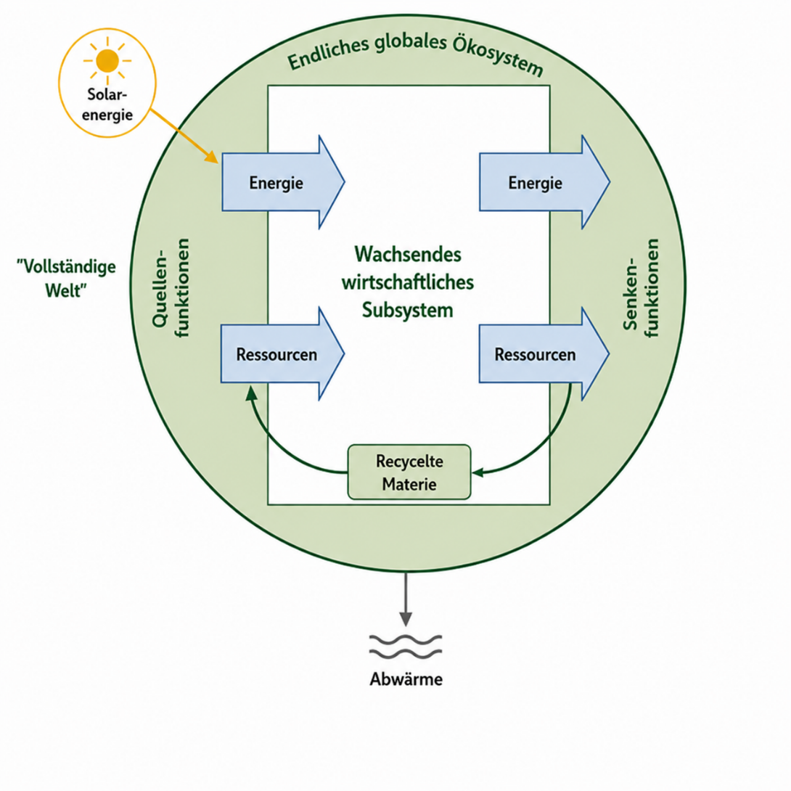
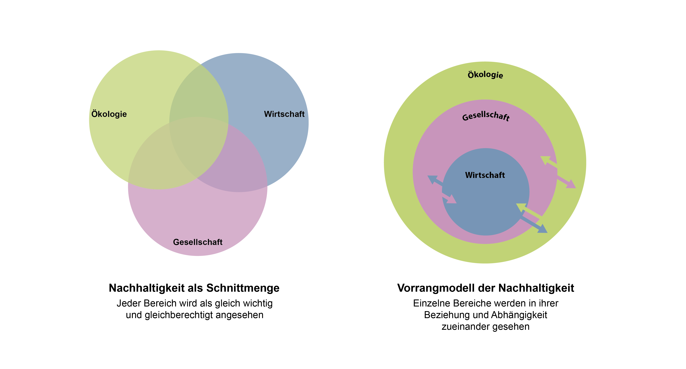
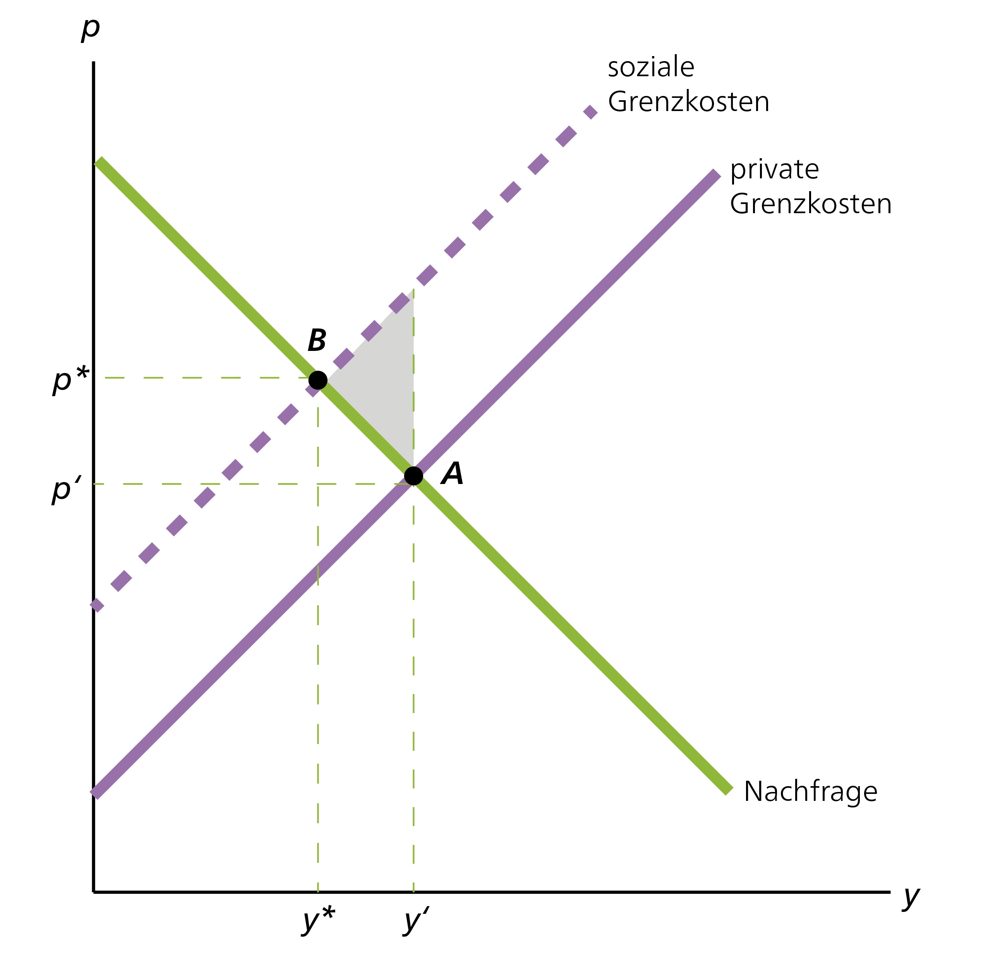
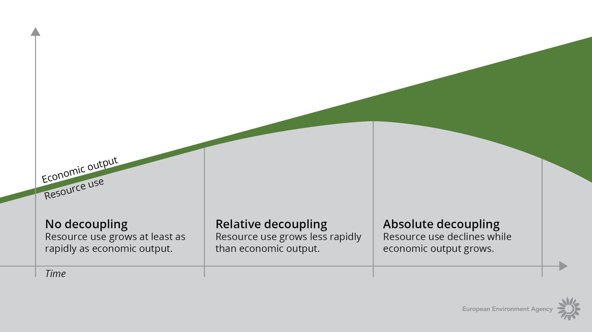
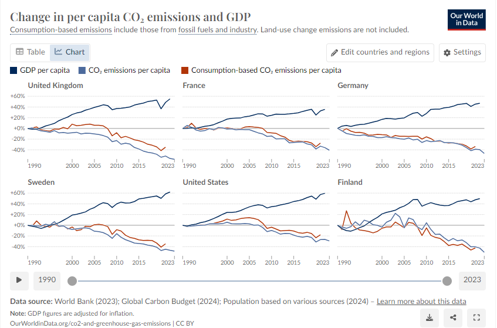
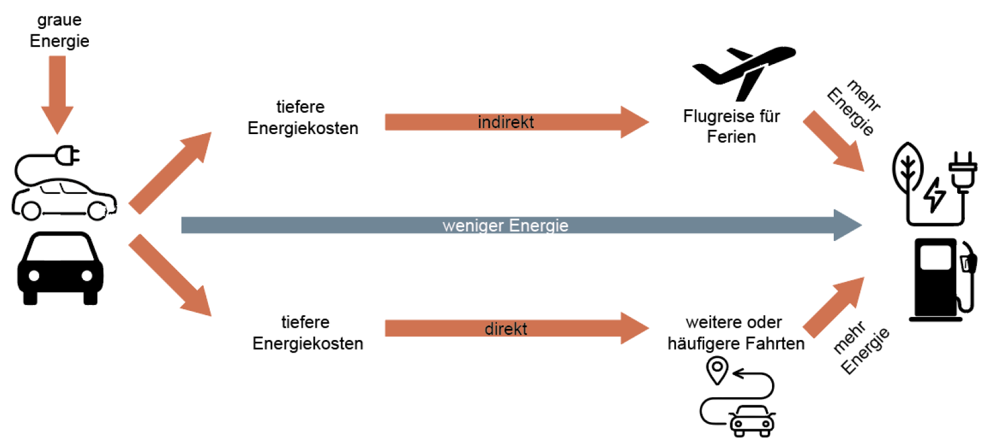
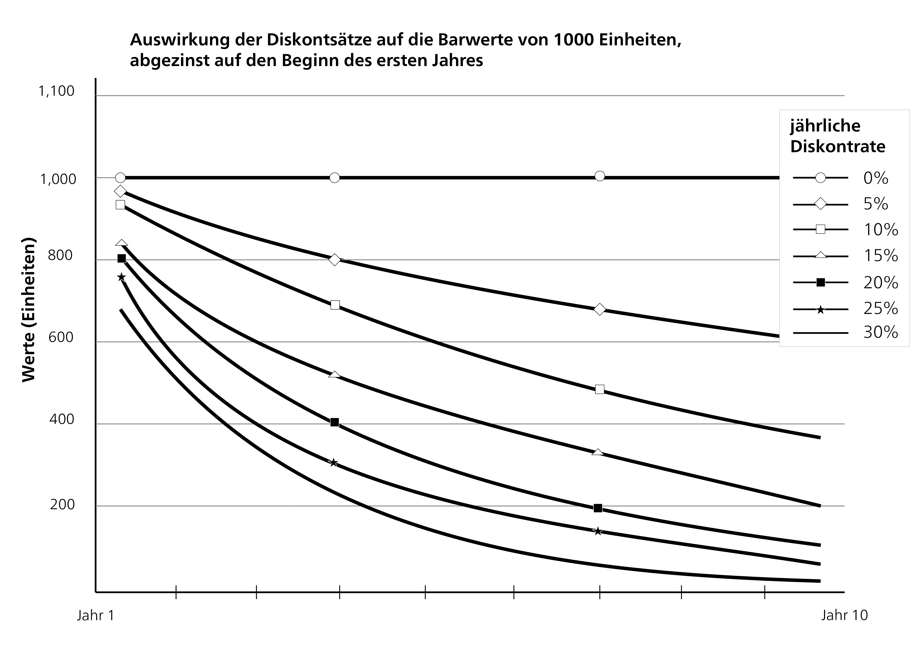
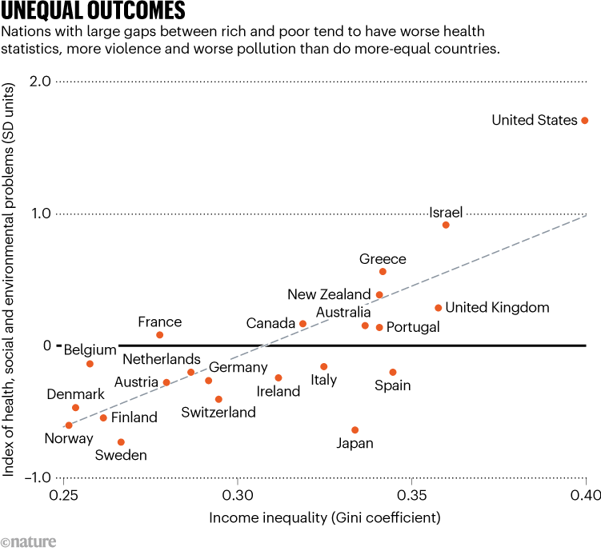
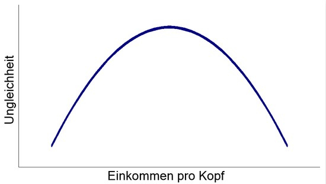
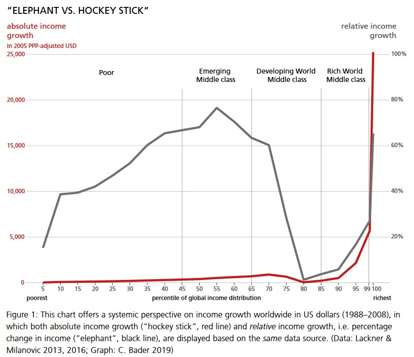

::: {.callout-note .guiding-question}
#### Guiding question

If prosperity for all -- within ecological limits -- is the goal we took as our starting point in Chapter 2: Why do we not achieve this goal, and what exactly stands in its way?
:::

The current way of doing business leads to major challenges, which manifest themselves in various crises. The current crises are referred to as a multiple crisis and, more recently, increasingly as a **polycrisis** [see, for example, @lawrenceGlobalPolycrisisCausal2024a or this [explainer video](https://www.weforum.org/videos/experts-explain-adam-tooze-what-is-the-polycrisis/) by Adam Tooze], because they touch people's working and living worlds in many ways and are interwoven with one another. Some of the individual crises are strongly connected and share common causes. Others appear rather independent of one another and do not necessarily have the same causes. Taken as a whole, however, all these crises culminate in this polycrisis, which often seems overwhelming. In this chapter, we devote ourselves to the **analysis of these crises** before turning to solutions for a sustainable economy. In what follows, we address the ecological and social problems separately. It is important to stress, however, that these dimensions are closely linked and can reinforce one another. The separation of these areas is meant to make the introduction easier.

As became apparent in the preceding chapters, the analysis itself is also shaped by the perspective a person takes. The problem analysis would turn out differently depending on the school of thought. Neoclassical economics, for example, does not necessarily see rising income and wealth inequality as a problem as long as it comes about through market mechanisms. A school of thought that includes aspects of power in its analysis, such as the feminist or the Marxist one, sees this inequality as a central problem for the economy and society. In line with the orientation of the course, we will frame the problem analysis as broadly as possible, across as many schools of thought as possible. Later in the course, we will also see more precisely which analyses and conclusions come from which school of thought. In the self-study phase, we first address the ecological limits of current economic activity and the relationship between nature and the economy. Then, in the fourth self-study phase, we look at the social limits of the current system and at how the economy and society are related.

## Ecological Limits -- How Much Earth Do We Actually Have -- and How Much Do We Use?

The ecological limits of our economic activity have been concretely tangible for some time and are not just abstract discussions about climate models. We can feel them in our everyday lives. While this script was being written in the summer of 2026, the fourth heatwave arrived in Switzerland, wildfires raged in France and Spain, and the consequences of heat and drought were noticeable everywhere in Europe. In the context of a sustainable economy, the question arises of how we connect these developments with economic activities or, more generally, how we can understand the relationship between the economy and nature. How we understand this relationship influences what we perceive as a problem and also forms the basis of the range of possibilities within which we can think about and develop solutions. Here, we will focus mainly on neoclassical and ecological economics, since they have two fundamentally different understandings of this relationship. While ecological economics emphasizes that the economy is embedded in the natural environment and necessarily depends on nature as its foundation, neoclassical economics understands nature and the economy as two separable spheres. Before we go into the basic understandings of this relationship in more detail (3.1.2) and look at what they mean for the problem analysis, we briefly look at some basic aspects of the ecological crises.

### Planetary boundaries and climate crisis

{#fig-acceleration}

In the wake of the Industrial Revolution, a uniquely productive mode of production emerged, which enabled a massive increase in material prosperity. At the same time, but far less noted, there was also a massive increase in the consumption of natural resources, environmental pollution, and emissions [@jarrigeContaminationEarthHistory2020]. Socioeconomic growth went hand in hand with the acceleration of biophysical trends. The description of exponential growth dynamics is called "the Great Acceleration" [@steffenTrajectoryAnthropoceneGreat2015b]. The graphic above shows, by way of example, some important biophysical and socioeconomic indicators, all of which begin to rise with the Industrial Revolution. From the middle of the 20th century, the tendency towards exponential growth becomes obvious.

::: {.callout-tip collapse="true"}
#### Excursus: Exponential growth

The exponential function is used to describe the size of things that are subject to accelerating growth. A decisive step is the realization that even moderate growth of, for example, five per cent means exponential growth, so the increase keeps getting larger (this applies, for example, to economic growth or to case numbers during the COVID-19 pandemic). Exponential growth is hard for us humans to grasp and is commonly underestimated, since the slope is quite moderate at the beginning. The growth rate, however, keeps increasing, because the moderate increase in the following year refers to the value that rose in the previous year -- and at some point it becomes enormous. A revealing figure that quickly exposes growth processes is the doubling time, which can easily be calculated in one's head: 70 divided by the percentage growth per unit of time. If something grows by seven per cent per year, the doubling time is ten years; at five per cent, it is fourteen years; and at one per cent growth, it is seventy years. The number 70 is the result of multiplying 100 (the percentage value of a doubling) by the natural logarithm of 2. You do not need to understand how this number is derived. All that matters is: 70 divided by the percentage growth.

For those who are interested, there is a documentary on exponential growth: "[Understanding exponential growth: The water lily principle](https://www.3sat.de/wissen/wissenschaftsdoku/211216-sendung-wido-100.html)" (in German). The following **thought experiment** also helps with understanding: A client offers you two different fees for a 64-day assignment. Which fee do you choose? A: You receive CHF 10,000 every day. B: You receive CHF 0.01 on the first day, and on every following day the amount is doubled.

@tbl-payoff-matrix shows the payoff matrix for this thought experiment.

```{r}
#| label: tbl-payoff-matrix
#| tbl-cap: "Thought experiment: Payoff matrix under linear versus exponential growth."

library(kableExtra)
is_pdf <- knitr::is_latex_output()

df <- data.frame(
  `Number of days` = c("8 days", "21 days", "26 days", "30 days", "64 days"),
  `Payout A` = c("CHF 80,000", "CHF 210,000", "CHF 260,000", "CHF 300,000", "CHF 640,000"),
  `Payout B` = c("CHF 1.28", "CHF 10,485", "CHF 335,544", "CHF 5,368,709", "CHF 92,233,720,368,547,758"),
  check.names = FALSE
)

df |>
  kbl(booktabs = TRUE, align = "l", longtable = is_pdf) |>
  kable_styling(
    bootstrap_options = c("striped", "hover", "condensed"),
    latex_options = if (is_pdf) c("hold_position", "repeat_header") else NULL,
    full_width = !is_pdf,
    font_size = if (is_pdf) 8 else NULL
  ) |>
  row_spec(0, bold = TRUE)
```

The payout of B after 64 days is more than 92 quadrillion CHF, which corresponds to about 95,000 times the wealth of Elon Musk (according to [Forbes](https://www.forbes.at/artikel/elon-musk-verliert-den-billionaersstatus), the richest person on Earth as of June 2026).
:::

Since the late 18th century, when the Briton Thomas Robert Malthus (1766-1834) first put forward a theory of overpopulation in his *Essay on the Principle of Population*, the discourse of a planetary carrying capacity has persisted in certain scientific theories. Even though Malthus's ideas have meanwhile turned out to be outdated -- he calculated the maximum population depending on a fixed quantity of producible food -- the basic idea returns in the form of neo-Malthusianism. In the study *The Limits to Growth*, published by the Club of Rome in 1972, a neo-Malthusian approach calculated a population limit also by means of available food, but additionally including available resources, environmental pollution, and industrial output. Although the predicted developments did not materialize, the study still carries weight today in an ecological perspective that problematizes limitless growth.

The latest theoretical development in this regard is the natural-science concept of **planetary boundaries**. Unlike before, these do not refer to a maximum population but to indicators from Earth system science. As a starting point, the researchers choose the state of the Earth system in the Holocene (the current and latest epoch of Earth's history, which began about 11,700 years ago). In this epoch, they argue, the planet had largely ideal conditions for giving rise to human civilizations. Deviations from this bring humanity into an uncertain zone in which tipping points can be reached. Crossing them can either halt previous developments, change their direction, or accelerate them strongly. One example is the extinction of many large mammals at the end of the last ice age following human migration to the American continent. The concept of planetary boundaries advises applying the precautionary principle here in order to reduce possible harm to humans and the environment. The current Planetary Health Check takes the planetary boundaries as a fundamental framework for evaluating the health of our planet [@ceasarPlanetaryHealthCheck2024; @sakschewskiPlanetaryHealthCheck2025a]. The recently founded initiative "[Planetary Health Check](https://www.planetaryhealthcheck.org/)" offers, besides the report, exciting opportunities on its website to engage with the planetary boundaries and their development over the last 70 years.

![Planetary boundaries of the various subsystems and the respective risk assessment of the current state. Green denotes the safe operating space, yellow an increased uncertainty. Beyond yellow indicates that the risk of fatal consequences is assessed as high. Source: @sakschewskiPlanetaryHealthCheck2025a [p. 29].](images/fig2.png)

The planetary boundaries refer to nine different subsystems, such as land-use change or ocean acidification. For each of them, an inner circle (safe operating space) and an outer circle (increased uncertainty) are defined. Seven of the nine planetary boundaries have already been crossed [@sakschewskiPlanetaryHealthCheck2025a]. For ocean acidification, the boundary has recently been crossed for the first time, while aerosol loading is declining somewhat again. While the trend for stratospheric ozone levels does not show a clear direction, the degree of transgression is increasing for all boundaries previously identified as crossed [@sakschewskiPlanetaryHealthCheck2025a].

Within these nine subsystems, there are two so-called core boundaries: biosphere integrity and climate change. These two systems combine the processes of many other subsystems and act at a supraregional level. Reaching tipping points in these two systems can therefore push the entire Earth system into a new state. The rapid changes in the climate in particular pose a major challenge to humanity in the 21st century. Because the energy system, the transport infrastructure, and industrial agriculture are based on fossil fuels such as oil and gas, excessive amounts of greenhouse gases such as carbon dioxide and nitrogen oxides are continually emitted. These accumulate in the atmosphere and prevent the heat that reaches the atmosphere through solar radiation from escaping again (greenhouse effect). As a result, glaciers and ice sheets have shrunk, the oceans have become warmer, and sea levels have risen over the last 30 years. Extreme temperature anomalies and precipitation events are also continually increasing. Today, the concentration of greenhouse gases in the Earth's atmosphere is the highest in the last 800,000 years, and the global average temperature has risen by more than one degree Celsius since the Industrial Revolution.

To avoid reaching tipping points in the climate, climate policy set the two-degree target with the Paris Agreement in 2015. The rise in average temperature since the Industrial Revolution is to be kept "well below 2 degrees Celsius". Even at two degrees of warming, massive biophysical changes are likely. And to reach this target, energy supply must forgo fossil fuels entirely from 2050. Such a shift poses major challenges for society, in particular because fossil energies were a central factor in the development of the current economic system and strongly structure it [see, for example, @huberFuelingCapitalismOil2013; @kallisOilEconomySystematic2017; @malmFossilCapitalRise2016].

### Different understandings of the nature-economy relationship

*↗ Textbook chapter 7*

As already discussed in Chapter 2 on the scope of economics, some schools of thought understand the economy mainly as a separate sphere in which actors interact on markets. Others emphasize the embeddedness of economic activities in society and nature. We already encountered this distinction in Chapter 2.3.1, where we dealt with land as a factor of production. Neoclassical economics focuses very strongly in its understanding on a separate economic sphere. These efforts to study a separate economic sphere in isolation go back, among other things, to the marginalist revolution, when attempts were made, among other things, to separate economic motives from non-economic motives in humans. Accordingly, in this understanding, the economy stands to some extent alongside nature, and the two are of equal standing (see @fig-econ-nature).

.](images/fig3.png){#fig-econ-nature}

A fundamentally different understanding emerges for ecological economics. Here, the economy and nature are not conceived side by side, but the economy is understood as embedded in an ecosystem. The economy is a subsystem of the global ecosystem and completely dependent on its functions. All economic activities rely on the extraction of energy and raw materials from nature and inevitably end in the form of waste and emissions that are released back into the environment. The economy therefore cannot be understood independently of the biophysical limits of the planet. While capital, labour, or knowledge can be increased, the Earth's resources and its capacity to absorb pollutants are limited. @fig-finite-ecosystem conceptualizes the embedding of the economic subsystem in a larger finite global ecosystem. The economy is thus embedded in a finite global ecosystem, draws energy and resources from it (source function), and also releases matter and energy back into this ecosystem (sink function). Only solar energy newly enters the system from outside, while waste heat leaves the Earth at the same time.

{#fig-finite-ecosystem}

These fundamentally different understandings have important consequences for how we can understand sustainability. The concept of sustainability can be placed on a continuum from weak to strong (see @fig-strong-weak-sustainability). While the neoclassical understanding entails a weak understanding of sustainability, ecological economics has a strong understanding of sustainability. In what follows, we go into the two understandings.

{#fig-strong-weak-sustainability}

#### Weak sustainability -- the neoclassical position[^3_intro-1]

[^3_intro-1]: Excerpt from @pufeNachhaltigkeit2017 [p. 105ff.] and <https://thesustainablepeople.com/starke-und-schwache-nachhaltigkeit/> (in German).

Weak sustainability sets a rather "lenient" requirement for sustainability. For the proponents of this view, an action is sustainable if it offers an advantage to the overall system or at least does not diminish its quality. Weak sustainability can therefore be regarded as a kind of basic requirement for sustainability, with the aim of maintaining a certain level of well-being or quality of life or of ensuring equality. The concept of weak sustainability "assumes the far-reaching and, at least in principle, unlimited \[…\] substitutability of all kinds of capital" [our translation of @ottTheorieUndPraxis2004, p. 41] and is thus based on the premise of neoclassical economics, which conceives the different spheres as standing side by side with equal standing. Natural capital, for example, can be replaced by other capital; the loss of biodiversity, for instance, could be replaced by technological capital. It is assumed that it is ultimately irrelevant in what physical composition the inherited capital stock is passed on to the next generation -- what matters is only that total capital and total utility, and thus the overall level of welfare, are maintained. The concept of weak sustainability builds on neoclassical utility theory, according to which it is irrelevant how utility is generated. Environmental economics, which emerged from neoclassical economics, fundamentally draws on the concept of weak sustainability.

Within the concept of weak sustainability, a measure can nevertheless be regarded as sustainable even if it comes at the expense of natural capital. This is the case, for example, if the loss is compensated by an increase in human or manufactured capital. The extraction of raw materials such as coal or excessive crude oil production could accordingly be quite defensible. This understanding tends to recognize the strong role of technological progress for sustainable development. Assessing measures on the basis of such a concept is naturally complex, since it is always tied to many assumptions. Apart from fundamental questions about sustainability such as "What is a good life? How is the level of prosperity measured?", this approach requires that the value of the different types of capital be determined. In practice, this means that a monetary value is attributed to everything. As we saw in Chapter 2.3.1 on land, this is an important prerequisite for substitutability. It makes the different types of capital comparable and interchangeable. Even where there is no market price, a monetary value must therefore be set. Whether such monetary valuation is possible or sensible is discussed again and again. On the one hand, there is the question of whether we can give nature a price; on the other, monetary valuation necessarily implies the substitutability of the natural environment. As early as 1974, William Kapp doubted whether this monetary valuation manages to capture the substantial social value that is actually at stake [@kappEnvironmentalPoliciesDevelopment1974]. In addition, fundamental and normative questions arise in operationalization. Which factors are then taken into account? What is the value of the beauty of nature? What is the value of a rare bird or a whale? This short [video](https://www.youtube.com/watch?v=MSxIBYOMQOU) gives insights into such questions. Monetary valuation then forms the basis for cost-benefit analyses, in which, for example, the costs of a climate measure are weighed against its benefits. In the excursus further below, you will find, if you are interested, the opportunity to dive somewhat deeper into this topic.

#### Strong sustainability -- the ecological economics position

In contrast to weak sustainability, the strong sustainability position regards the value of natural capital as irreplaceable. Characteristic of the proponents of the strong concept of sustainability is that their optimism regarding the individual possibilities of substitution is considerably lower. They therefore emphasize the importance of an intact "natural capital stock". That the natural capital stock could be drastically reduced in favour of another type of capital is unthinkable to them. Human-made capital and natural capital are interchangeable only to a limited extent. Proponents of strong sustainability thus start from an ecocentric view, in contrast to the anthropocentric view of weak sustainability.

In contrast to the confidence of neoclassical economists regarding substitutability, advocates of strong sustainability do not believe in solutions based on remediation and reaction but rely on prevention and anticipation. For example, the growth of the ozone hole can be compensated only to a limited extent by measures such as sunscreen, protective clothing, and medical aftercare. Even technological approaches such as geoengineering are viewed critically, since they treat the problem superficially instead of addressing its causes. Geoengineering refers to technical interventions in geochemical or biogeochemical cycles in order, for example, to slow climate change or ocean acidification.

So far, the reduction of environmental pressures has mainly concentrated on end-of-pipe technologies, such as flue-gas cleaning systems on factory chimneys or catalytic converters in cars. At the same time, long-term environmental problems were pushed into the background by such measures as long as their effects were not perceived clearly enough, as in the case of climate change or the loss of biodiversity. This apparent protection of the environment is explained by the concept of **externalization**, in which environmental and social costs are shifted outwards, as described, for example, by @lessenichNebenUnsSintflut2018. This means that pricing takes into account only macroeconomic and business-economic costs, partly because these are easier to quantify, while the social and ecological costs of providing goods and services are left out or shifted outwards. This leads to distortions in market prices.

### Climate crisis -- market failure or systemic problem

As explained above, climate change concerns one of the central planetary boundaries and is probably one of the greatest societal challenges of this century. Although all schools of economic thought recognize the climate crisis as a central problem, they differ greatly in how they understand and explain it and in what policy measures can be derived from it. While neoclassical economics sees the climate crisis above all as a major market failure, which can be solved by creating a functioning market, ecological economics, for example, sees the problem more fundamentally in the capitalist mode of production, that is, in the way we do business. In what follows, we look at the two understandings using climate change as an example. Such a juxtaposition could be applied in a similar way to many ecological crises, for example biodiversity loss, since the underlying differences lie in the understanding of the fundamental nature-economy relationship.

#### Climate change as market failure

From the perspective of neoclassical economics, the climate crisis is first and foremost a market failure. As explained in Chapter 2.5.2 (*The market as central coordinating mechanism*), markets are fundamentally regarded as efficient institutions for coordinating economic activities. Under certain conditions (perfect competition), they ensure that resources are used where they create the greatest societal benefit. Since the price mechanism is central to the functioning of markets, an important prerequisite for this is that all costs and benefits of an economic action are reflected in market prices. If this is not the case, the price mechanism cannot function optimally.

And this is exactly the case with the climate crisis. Through the emission of greenhouse gases, companies and households cause costs that are borne not by themselves but by society. These costs are not automatically included in the market price of goods. Such consequences not included in the market price are called negative externalities (see Chapter 2.4.2, *External effects -- why does a flight often cost less than a train ride?*). The costs of climate change -- such as extreme weather events, crop failures, or biodiversity losses -- are therefore not fully reflected in the prices of fossil fuels. Fossil energy appears artificially cheap, which produces more emissions than would be desirable for society. This is shown in @fig-welfare-loss. The dashed red line would correspond to the social marginal costs, and the solid red line corresponds to the private marginal costs. Since only the private costs are reflected in the price, the price of goods based on fossil fuels is too low, and accordingly the quantity at market equilibrium A is too high. Concretely, this means that the quantity of CO~2~ emitted is too high. If all social costs were reflected in the price, the optimal market equilibrium would be at point B with a quantity y\*. The grey triangle denotes the overall economic welfare loss caused by these negative externalities.

As hinted in Chapter 2.5.2 (*The market as central coordinating mechanism*) (and set out in more detail in Chapter 5), market failure is, in neoclassical economics, a reason for the state to intervene. According to this analysis, the central economic policy task is now to internalize these external costs. This means that all costs and benefits are integrated into the price. The polluter-pays principle (that is, that the costs are borne by those who cause them) is to be restored by putting a price on emissions. The most important instruments include CO~2~ taxes or emissions trading systems, in which CO~2~ emissions receive a price and are traded via a market. Both approaches aim to raise the price of fossil fuels and thereby create incentives for lower-emission technologies, innovation, and behavioural change. Companies and households then decide for themselves how they reduce their emissions at the lowest cost. From a neoclassical perspective, market-based instruments therefore enable efficient climate protection at the lowest possible overall economic cost, since in this way we move to the optimal equilibrium point B. This approach requires the substitutability from weak sustainability and that it is possible to put a price on all costs and benefits (for example the loss of biodiversity), as explained before.

{#fig-welfare-loss}

In this approach, fundamental structures are taken as given, and accordingly the fundamental economic order is not called into question. Markets continue to be regarded as a suitable mechanism for allocating resources; they merely have to be corrected where market failure occurs. Economic growth is accordingly not regarded as a problem. Rather, it is assumed that, with functioning markets, price signals, technological progress, and innovation can lead in the long term to a decoupling of economic growth and environmental pressure.

#### Climate change as systemic problem

Ecological economics does share the assessment that environmental costs are often externalized, but it interprets the climate crisis in a fundamentally different way. It regards climate change not merely as a market failure but as a symptom of an economic system that is based on permanently rising material and energy throughput and thereby exceeds the planetary boundaries of the Earth.

The starting point here is the understanding, discussed several times, that the economy is not an independent system. Against this background, the climate crisis appears not as an isolated environmental problem but as an expression of fundamental tensions between economic development and the ecological carrying-capacity limits of the Earth system. Climate change is thus closely linked to other ecological crises -- such as the loss of biodiversity, the overuse of natural resources, or the disruption of biogeochemical cycles. The various environmental problems are understood as interconnected symptoms of an economic system whose material and energy throughput is continually growing.

In contrast to neoclassical economics, ecological economics therefore does not understand environmental problems primarily as the result of missing market prices. The idea of negative externalities is not rejected, however. But these are not regarded as an exception in an otherwise functioning market; they are regarded as a structural feature of capitalist modes of production. Companies compete with one another and strive to keep production costs as low as possible. As long as a system is based on maximizing private profit, there is an incentive to shift costs onto people, society, and nature, that is, to externalize them [@kappSocialCostsPrivate1950; @saaveEinverleibenUndExternalisieren2022a]. The externalization of ecological costs is therefore not a random market failure but is understood as an inherent consequence of the growth and competition logic of capitalist economic systems.

Beyond this, ecological economics emphasizes the particular significance of economic growth. Historically, the growth of gross domestic product went hand in hand almost everywhere with rising consumption of energy and materials. Although the resource and energy intensity of many production processes has fallen, these efficiency gains were often overcompensated by the growth of production and consumption. For ecological economics, what is decisive is therefore not only how efficiently resources are used but whether absolute resource and energy consumption stays within the planetary boundaries.

In this context, it distinguishes between relative and absolute decoupling from economic growth. Relative decoupling is said to occur when resource consumption or emissions grow more slowly than gross domestic product. Absolute decoupling, by contrast, occurs only when environmental pressure actually falls despite continued economic growth (see @fig-decoupling).

{#fig-decoupling}

While relative decoupling can be observed in many countries, proponents of ecological economics are sceptical about the possibility of lasting absolute decoupling on the scale required globally. Part of the observed emission reductions in industrialized countries is also based on the relocation of resource-intensive production to other regions of the world rather than on an actual reduction of global material and energy consumption. As shown in @fig-absolute-decoupling, absolute decoupling can be observed in some countries of the Global North (although not all emissions are included). This concerns, however, not resource consumption but only CO~2~ emissions, and it remains questionable whether this is possible at the global level. At the global level, no absolute decoupling of CO~2~ emissions and economic growth can be observed.

{#fig-absolute-decoupling}

Another important point is the discussion on *rebound effects*. Technological innovations often increase the efficiency of resource use but thereby often make products and services cheaper. Falling costs can in turn lead to greater demand, so that part of the originally expected environmental relief is lost again. Modern vehicles, for example, consume less fuel per kilometre than earlier models, but at the same time the lower costs can lead to larger vehicles being bought or more distance being travelled, which constitutes direct rebound effects. Indirect effects would occur here, for example, if the lower costs lead to more air travel on holidays, which can then also lead to higher energy consumption (see @fig-rebound-effect). Energy-efficient household appliances or buildings, too, do not automatically lead to a correspondingly lower energy consumption. From the perspective of ecological economics, efficiency improvements are therefore indispensable, but they alone are not sufficient to reduce absolute resource consumption sufficiently.

{#fig-rebound-effect}

The problem analysis of ecological economics leads to different policy conclusions than in neoclassical economics. It is also important to emphasize, however, that the internalization of external costs through CO~2~ prices or emissions trading is not rejected in principle; it is regarded merely as one building block of a more comprehensive transformation. Contrary to the neoclassical perspective, the economic system is fundamentally called into question here, and solutions also include fundamental transformations of the existing system. In self-study phase 6, we will look more closely at various possible approaches that follow from an analysis of strong sustainability, but also at those that are more oriented towards a neoclassical understanding. In many sustainability debates, the differences lie at their core in these fundamental differences.

::: {.callout-tip collapse="true"}
#### Excursus -- Cost-benefit analysis

Cost-benefit analysis makes it possible to weigh costs against benefits. This instrument makes it possible to evaluate the expected consequences of decisions by weighing the associated costs and benefits. The important precondition of this analysis is the monetary valuation of all consequences. Only in this way can an evaluation be made with comparable quantities. The establishment of cost-benefit analysis goes back to the discussion of social costs (external costs) in the 1950s and 1960s. Based on the work of economists such as William Kapp [-@kappSocialCostsPrivate1950], it was argued that the social costs that arise should be prevented through regulation. Ronald Coase [-@coaseProblemSocialCost1960], by contrast, argued that regulations, too, would constitute costs for companies: opportunity costs through forgone profit. For example, the profit of a chemical company that pollutes a river through its activity. This profit of the company would have to be offset against the social costs. According to Coase, such a total calculation is supposed to provide a basis for arguing against regulations and for extending property rights (that is, the market).

Cost-benefit analysis has several problems. One difficulty is that the value of many areas of societal and natural life cannot be clearly expressed in a price. It is not possible, for example, to put a clear and objective price on an endangered animal or plant species, the existence of a forest, clean air, or a human life. To meet this challenge, researchers have developed various methods intended to make it possible to quantify monetary values. Two main procedures are important here: with **stated preference methods**, actors can be asked about different future scenarios. Previously unknown circumstances can thus be weighed against one another. In **revealed preference methods**, a utility valuation for the future is derived from decisions already made. This prevents actors from giving strategic answers when valuing expected future scenarios. However, conditions that have not occurred before cannot be valued. Although there are established procedures for valuing preferences, they are limited in their possibilities for weighing costs and benefits. As the term "preference" already suggests, these are always subjective views. The monetary valuation derived from them will therefore also always be subjective, that is, not an objective number.

**Example:**\
At the beginning of this millennium, it emerged that the tobacco company Philip Morris had commissioned a cost-benefit analysis in the Czech Republic on the effects of smoking on the country. The authors concluded that smoking made an annual profit of about 5.8 billion crowns (about USD 150 million) for the Czech state budget. Because of the lower life expectancy of smokers, the state has to provide for them for a shorter time and therefore saves money. This report triggered a public outcry, whereupon the tobacco company apologized. But this example also shows the subjective nature of cost-benefit analysis. By reducing the value of human years of life to a number, the company had not only crossed a moral line. As a scientist later showed, the company had also made false assumptions and left out wider-reaching costs in the report. Her cost-benefit analysis of the same scenario concluded that smoking in the Czech Republic contributed to an annual deficit of about 14 billion crowns.

A further problem is that a cost-benefit analysis implies that the different types of capital are substitutable for one another, that is, that the loss of biodiversity, for example, can be technologically substituted. We discussed this problem in detail in this chapter.

**Discounting -- the time factor**

The time factor is included in cost-benefit analysis by means of *discounting*. This means that costs incurred in the future are valued as smaller. The discount rate influences how strongly perceived costs decrease with the passage of time. Various decision bases can be used to determine the discount rate. Intergenerational justice, the decision between strong and weak sustainability, the uncertainty of future events, or the time preference of the decision-makers influence how strongly future costs are discounted.

{#fig-discount-rates}

@fig-discount-rates shows different discount rates over the same period. The costs of climate damage of CHF 1,000 occurring in 15 years, for example, are valued at about CHF 800 at a discount rate of 1.5%. At a rate of 5%, only about CHF 460 are included as perceived costs in the cost-benefit calculation.

**Example:**\
In 2006, the British economist Nicholas Stern published the so-called [Stern Report](https://webarchive.nationalarchives.gov.uk/ukgwa/20100407172811/https:/www.hm-treasury.gov.uk/stern_review_report.htm){target="_blank"} on behalf of the British government. In this comprehensive document, he describes climate change as the greatest market failure in history and argues by means of cost-benefit analysis that one per cent (later he argued for two per cent) of global GDP must be invested in emission reduction. Economists reacted to Stern's report in mixed ways. While some supported it, others argued that he calculated the costs of global warming incorrectly. The main argument was his low discount rate of 0.1 per cent, which he used to value future costs. The economist William Nordhaus took over Stern's calculations and changed only the discount rate from 0.1% to 3%. Accordingly, investments against global warming are still necessary but considerably lower than Stern demanded. In the logic of cost-benefit analysis, Nordhaus concludes that global warming in the optimal scenario rises to more than 3 degrees by 2100 [@nordhausClimateChangeUltimate2019]. In this example, the question of the discount rate constitutes a clear ethical positioning. Stern chose the rate of 0.1%. He argues that future generations should not be given less weight because of their later point in time. The discount of 0.1 represents the low risk that humanity is wiped out by a catastrophic event. Nordhaus's discount rate, by contrast, weights the welfare of coming generations by 3% less with each year. This is on the assumption that the economy grows continuously at this rate and future generations will accordingly be wealthier, and the costs will weigh less in the future.

The calculation of costs and benefits in the future thus depends on many assumptions and ethical questions. These are meant to be represented numerically in the discount rate.
:::

::: {.callout-caution collapse="true"}
#### Further reading

Buller, Adrienne. 2022. *The Value of a Whale: On the Illusions of Green Capitalism*. Manchester University Press.
:::

## Social Limits: Is the Pie Growing for Everyone -- or Only for a Few?

*↗ Textbook chapters 8 and 9*

When industrial production in the cities picked up speed in the early 19th century, industrialists needed workers en masse. They "found" them through increasing internal migration from rural areas. Through the advancing *enclosure* and privatization of the commons, a large part of the rural population increasingly lost its livelihood and had to migrate to the cities to earn a living there as industrial workers. Only in this way could industrial production and the capitalist market economy establish themselves as a new economic and social system. But the economic upswing by no means benefited all those involved equally: while factory owners attained unprecedented wealth, growing destitution prevailed in the new working-class districts. Countless reports testify to an unprecedented extent of suffering and inhumane conditions, both in the factories and in the overcrowded barracks of workers' families. Shifts of 14 to 16 hours without breaks, child labour, and appalling health risks were the bleak norm. But anyone who insisted on rights quickly risked their job and thereby pushing their family to the brink of survival from misery: there was no shortage of labour, and the hardship was great enough that any conditions had to be accepted.

But criticism of the new conditions, and in particular of human destitution, also manifested itself early on. Besides the first self-help associations such as consumer cooperatives, intellectual responses to the misery of industrial capitalism also increasingly formed. Various wings of early socialism named the problem of the dehumanizing conditions (for example, Robert Owen in England). The objections to the market system were mostly formulated from the perspective of the working class. People did not want to simply keep accepting the miserable situation in which wage workers and their families found themselves. A central endeavour, for example, was the organization of the workers in cooperative associations that organized both the production and the distribution of goods according to principles of a fair wage and concrete need.

In the middle of the 19th century, Karl Marx, a German living in industrial England, set about writing the most influential critique of capitalism to this day. Almost a century later, Karl Polanyi (1886-1964) finally described, from a historical perspective, human misery as a necessary consequence of a market society. Polanyi described the *market* of the time as a capitalist market that had slipped away from any social control and was in this sense "disembedded". He explained his observation by the inclusion of money, labour power, and land in the market-mediated process of price formation. In his conviction, only this gave rise to a system of market exchange detached from all normative restrictions, which tends to destroy all social obligations, reliabilities, and notions of honour in the lifeworld. At the same time, according to @polanyiGreatTransformation2017, the complete *commodification*, and thus the creation of a pure market society, could nowhere fully prevail, since societies at a certain point take countermeasures to counteract, for example, the emerging misery and societal disembedding and alienation [@polanyiGreatTransformation2017]. The trade union and cooperative movement establishing itself towards the end of the 19th and the beginning of the 20th century, but above all the emerging welfare state, can, in this reading, be understood as a counter-reaction inherent in simultaneously advancing capitalism. It has, to a certain extent, a double function of *limiting* it: to protect people from its consequences and, at the same time, to protect capitalism from itself.

### Social limits in the 21st century

As @fig-acceleration under the ecological limits shows, in the 20th century not only Earth system trends but also socioeconomic ones accelerated strongly. Although social progress (or counter-movements) has noticeably reduced extreme poverty and misery in many industrialized countries, various social limits worldwide are at similar risk of being crossed as ecological ones. *Doughnut Economics*, a well-known book and framework of the same name by the economist Kate Raworth, accordingly supplements the nine "planetary boundaries" with twelve "social foundations" [@raworthDoughnutAnthropoceneHumanitys2017]. These include, for example, food security, health care, and access to education. In a similar way, the 2030 Agenda, adopted by all UN member states, reflects in its 17 *Sustainable Development Goals* (SDGs) the continuing urgency of social questions as part of sustainable development.

Despite this supposedly broad acceptance of the goals, social limits are often less clear to draw than planetary boundaries and are accordingly discussed more controversially. As we will see, social questions are closely tied to ideas of justice and of a good life. The term "boundary" is therefore less obvious at first glance, especially in comparison with the biophysical limits of planetary ecology. On closer inspection, however, the notion of a social boundary, or a foundation that must not be fallen short of, makes perfect sense if we understand society and humanity as a whole as social systems whose functioning -- similar to ecology -- can be thrown out of balance. This can happen through social as well as primarily economic changes, which moreover often complement each other. The misery of workers in early capitalism, for example, was at first glance characterized by material poverty, but migration to the cities also meant being torn out of the familiar social environment with all its contacts and rhythms.

Today, too, scientists emphasize social limits that go along with the ever-recurring need to adapt to constantly new laws of capitalist economy and society. The German sociologist Hartmut Rosa describes modernization as a process of "social acceleration" [see, for example, @rosaBeschleunigungUndEntfremdung2024; @rosaSocialAccelerationEthical2003a]. According to Rosa, alongside technological progress, **social change**, for example the change of social relationship patterns, and the **pace of life** also accelerate. These acceleration processes are driven by economic, cultural, and structural factors and mean that, despite constant technological progress and the associated efficiency gains, we increasingly feel short of time and stressed. For example, the enormous advances in communication technology have made it possible for us to communicate over long distances much more efficiently (for example emails instead of sending letters). Where we once wrote at most a few letters, the number of emails sent has increased massively, so that we fill the freed-up time, to a certain extent, with sending additional emails, which in turn brings further obligations and changes relationship patterns. The possibilities and demands of being reachable have thus increased, for example. With technological progress, the possibilities of experiencing parts of the world also accelerate, for example through advances in transport and communication, but also in completing more and more tasks with the help of artificial intelligence. The potentially experienceable world grows faster than the share we can actually experience. Relatively speaking, the share of the world that we can experience therefore shrinks. Such acceleration dynamics have effects on the social well-being of individuals and societies and therefore cannot be disregarded.

A further social limit that increasingly occupies economists (although by no means all of them) is the growing inequality of income and wealth in many places and globally. But why can income and wealth inequality be described as a social limit? The epidemiologists Kate Pickett and Richard Wilkinson, for example, have shown that social, health, and environmental problems are considerably more pronounced in OECD countries with high inequality than in countries with low income inequality, as @fig-unequal-outcomes shows [@wilkinsonSpiritLevelWhy2011; @wilkinsonWhyWorldCannot2024]. With increasing inequality, for example, child mortality rises and life expectancy falls. According to Pickett and Wilkinson, the reason could be, for example, the higher stress caused by status competition. In addition, post-Keynesian economics emphasizes that distribution can also have important effects on the economy and that high inequality can have a negative effect on aggregate demand: if most people would like to spend more but cannot, while a few rich people save most of their income as wealth, less is consumed overall [see, for example, @kalaitzakisFunctionalPersonalIncome2026]. Furthermore, strong inequalities are also closely related to the ecological limits of the previous section: as many studies show, the rich have a disproportionately larger ecological footprint than everyone else [@wilkinsonWhyWorldCannot2024] (see also Chapter 17 in the textbook).

Because of these various and interwoven developments, many observers also see in spatial income inequality the explanation for the rise of populist political parties and the accompanying socio-political destabilization. These in turn are linked to one of the fundamental questions of social coexistence: that of justice. To get to the bottom of the complexity of inequality, we devote the rest of the chapter to this topic, by looking in turn at different concepts of justice and different economic perspectives on the types and causes of inequality.

{#fig-unequal-outcomes}

### Justice and inequality

*↗ Textbook chapter 6*

Questions about justice and just distribution concern almost every social interaction in some way. While a "sense" of justice, much like the capacity for language, is part of the basic mental equipment of humans (although it can also be observed in non-human life), questions of justice have been in focus since the beginnings of Western philosophy. From Plato in ancient Greece to Martha Nussbaum in the 21st century, very different conceptions of what makes a just society have emerged. In what follows, we look at some approaches in more detail.

A good entry into the complex question of justice takes our intuitive sense of justice as its starting point. This is often based on a form of **reciprocity**, or mutuality. If I do you a big favour, we often find it fair or just if you return the favour at some point, even if possibly subject to our different dispositions. A first differentiation is already hidden here: if we are on an equal footing or similarly disposed, one speaks of "balanced reciprocity", but if our positions differ fundamentally (for example rich/poor, king/subject), then justice requires "unbalanced reciprocity", for example: whoever has more gives more, but, depending on the case, also has more entitlement [@johnstonBriefHistoryJustice2011].

Although this reciprocity-based understanding of justice is still of great importance in social psychology today, it played hardly any role in the philosophy of justice for a long time -- even though it actually stood at its very beginning. Plato formulates his definition of justice as a direct answer to such an intuitive understanding, which is put forward by Socrates' interlocutors (Plato's philosophy has been handed down to us largely through so-called "Socratic dialogues", that is, dialogues between Plato's teacher Socrates and other scholars). Plato's approach, later developed further by his student Aristotle, no longer defines justice through intuition but through a societal goal: what is just is what serves the good life, which is why one speaks here of a **teleological understanding of justice** (Greek *telos* = goal).

Although Plato and Aristotle do not clearly address many questions that are significant today, the step towards a goal-oriented (or consequentialist) concept of justice had major philosophical consequences. A more modern variant of teleological justice, **utilitarianism**, still represents an important philosophical current today, one that is widespread among many neoclassical economists in particular. At the core of utilitarianism is the search for the greatest possible overall societal benefit (*utility*), which is achieved by calculating and maximizing the total sum of positive and negative consequences. In utilitarian logic, it is therefore permissible, for example, to treat equals unequally, as long as the improvement (or utility gain) of one person is greater than the deterioration (or negative utility) of another. What counts is the total utility and thus also pure efficiency, or the maximum output that can be achieved with a given quantity of resources -- regardless of its distribution and even if the poor become poorer and the already rich richer as a result. In this pure efficiency logic, however, the radicalism of the utilitarian position is also hidden.

A closely related but weakened variant of utilitarian logic is a definition of **justice as Pareto efficiency**. This maxim makes an important exception: while it retains the goal of maximizing overall societal utility, actions are accepted only if they make no one worse off. A state that is more efficient in itself thus counts as Pareto-superior only if no one is harmed at the same time. This restriction is also significant because, unlike utilitarianism, it also brings the well-being of the individual into focus: for us to define an action as just, we no longer need information only about the total sum of positive and negative utility but also about its distribution. This opens the door to theories of justice that are no longer derived from a societal goal but focus on the well-being of the individual and the ethics of an action as such (so-called deontological theories). As we saw in Chapter 2.5 (*Abstract Markets or Capitalist Production System*), this maxim forms the central reference point in neoclassical economics for judging whether a (market) outcome is efficient. Since this criterion can very rarely be met in reality, the Kaldor-Hicks criterion is also frequently applied, which states that a change is efficient for the economy as a whole if the winners could hypothetically compensate the losers for their losses and would still be better off afterwards. Whether the losers are then actually compensated for their losses often plays no central role. With this criterion, we are back at the utilitarian view.

Probably the most influential modern theory of justice was formulated in 1971 by the American philosopher **John Rawls**, drawing on his deontological predecessors such as Immanuel Kant. Rawls addressed the question of which rules the members of a society would agree on regarding the distribution of resources without knowing their own position, abilities, and conception of the good [@rawlsTheoryJustice1999]. Behind such a "veil of ignorance", Rawls argues, people would, on the one hand, agree on a system of equal basic liberties (such as respect for human dignity) and, on the other hand, accept inequalities only under two clear conditions:

> "first, they are to be attached to offices and positions open to all under conditions of fair equality of opportunity; and second, they are to be to the greatest benefit of the least advantaged members of society." [@rawlsTheoryJustice1999]

The first condition is widely known -- everyone should in principle get the same opportunities. The second condition, the difference principle, is less intuitive but also places well-founded limits on the equality of outcomes. Since behind a veil we would not know our abilities either (for example intelligence) -- and thus whether we would really have equal opportunities in a world of pure equality of opportunity -- we would accept inequalities only if they benefited the worst off the most. If we assume, for example, that inequality boosts economic growth, then this growth should benefit the poorest more than everyone else. A well-known phrase in the preamble to the Swiss Federal Constitution loosely takes up this thought: "that the strength of the people is measured by the well-being of its weakest members". Rawls's *A Theory of Justice* subsequently became a kind of core reference to which later theories of justice had to relate in order to distance themselves from it and develop it further [@rawlsTheoryJustice1999]. Important contributions to the debate criticized, on the one hand, the restriction of justice to questions of distribution. Nancy Fraser and others emphasized in particular the importance of fair processes, participation, and recognition as a dimension of justice that precedes and is independent of distribution [e.g. @fraserRethinkingPublicSphere1990].

On the other hand, the question gained in importance of what should actually be distributed justly -- and, in subtle allusion to the ancient Greeks, what this has to do with the good life. Especially since the 1980s and 1990s, thinkers have engaged in various ways with the observation that human development and a life worth living can be measured only to a limited extent by material prosperity. Two of the most important voices in this debate are the economist and philosopher Amartya Sen and the philosopher Martha Nussbaum, whose work underlies the now widespread Human Development Index (HDI) (see Chapter 2.1.2, *Alternative indicators of prosperity*). Besides material prosperity, this index also captures life expectancy and the number of years of schooling, but it is based on Sen's and Nussbaum's concept of so-called "capabilities" [@nussbaumCapabilitiesFundamentalEntitlements2003; @senCommoditiesCapabilities1999]. Instead of a universal measure of development (such as material prosperity or resources), the capabilities approach puts people's own ideas of well-being at the centre, or rather each person's capabilities to realize these ideas. Since the resources required for this can differ greatly depending on the person and context, the focus on capabilities embodies a significant departure from concepts of justice and of the good life that rest exclusively on material prosperity. By moving non-material dimensions of well-being to the centre, such as the possibility of maintaining personal relationships or leading a long and satisfying life, the capabilities approach presents a slightly relativizing view of the dominance of economic realities and inequalities for human well-being.

As the [Human Development Report](https://hdr.undp.org/content/human-development-report-2025) published by the United Nations regularly shows, however, the HDI, too, is led by the materially richest countries. Regardless of which concept of prosperity and justice we use, it is therefore worth taking a closer look at the origins of economic inequality.

### Types and causes of inequality

*↗ Textbook chapter 17*

Inequalities in material prosperity, but also in the form of capabilities, have, on the one hand, grown historically, with global inequality in particular still being fundamentally shaped by colonial and postcolonial relations of domination. At the same time, these historically grown inequalities can also be observed "on a small scale": those who grow up with rich parents have a significantly higher chance of themselves being prosperous one day: access to education, hobbies, resources, networks, and so on explain a large part of intergenerational income inequality [@corakIncomeInequalityEquality2013]. With regard to wealth inequality, the factor of inheritance also comes into play: those who start life with substantial assets usually not only keep them but can often count on equally substantial passive income (for example from renting out residential buildings) or on independent appreciation in value (for example if the residential buildings were built long ago in a location that is central today and could be sold for many times the price).

At the same time, every "historical" inequality is also to be understood as the result of current economic and political conditions. Whether wages, profits, inheritance, redistribution, or even expropriation are perceived as just ultimately depends on the prevailing ideas of justice and how these manifest themselves politically. Besides taxes and welfare-state questions, this concerns in particular various areas of economic policy and the underlying economic paradigms. But what do the questions about distribution and inequality refer to concretely? In economics, several important distinctions are made in the first place: between income and wealth, between primary and secondary distribution, and between national and global inequality:

- **Income and wealth**: The total product of an economy (as measured by GDP) can also be understood as the summed income of the factors of production, that is, wages for labour, ground rent or rent for land, and profits and interest on capital. The shares that these factors of production earn of total income, or how income is distributed within these groups, is called income distribution, and its unequal distribution is called income inequality. Distribution and inequality of wealth, in turn, refer to the already "distributed" ownership of accumulated property, understood as a result rather than a process, in the form of money or possession of land (such as a single-family house or agricultural land) and capital (such as tractors or company shares). Wealth stands in a twofold relationship to income: on the one hand, a person's wealth corresponds to the accumulation of their personal income, although inheritance, especially among very wealthy people, is usually at the origin of their riches. On the other hand, wealth opens up new sources of income when it is invested in capital or land. The phrase "letting your money work for you" refers to precisely this connection.

- **Primary and secondary distribution**: This concerns income exclusively: primary distribution refers to the direct distribution of total income to the factors of production (or to workers and owners of capital and land). Secondary distribution refers to the outcome of distribution after state intervention, in particular through redistribution via taxes, which is meant to correct an overly unequal primary distribution (for example by supporting the unemployed with state funds, financed by taxing everyone else). The division into primary and secondary distribution is intuitive but contested, since it hides the role of the state in primary distribution and presents the latter as a quasi natural market outcome. Instead of primary and secondary distribution, people therefore also speak of functional and personal distribution (see textbook chapter 17).

- **National and global inequality**: When inequality is talked about, it is often either about the unequal distribution of income or wealth within a country, but just as often about inequality between countries. This distinction is indispensable for a meaningful discussion and can lead to a lot of confusion. For example, we generally have an approximate understanding of poverty in countries of the Global South, but struggle to compare the life of a rich person there with that of a poor person living in Switzerland.

In what follows, we first turn to income inequality and in particular to primary distribution in order to explore the causes of inequality from an economic perspective, but we already do so with an eye to both national and international distribution.

### Division of labour and comparative advantage

Besides the invisible hand, Adam Smith's pin factory is probably the best-known excerpt from his work. The first chapter deals with the division of labour in a pin factory and how it raises productivity to a great extent. Deriving from this, Adam Smith states more generally how productivity rises through the division of labour. Individuals, companies, or countries that specialize in an activity can perform it increasingly well. This creates an absolute advantage in production over others. Economic subjects increasingly specialize in those areas in which they are better than others. If a subject is superior to another in no area, it cannot take part in trade.

David Ricardo later criticizes Smith's theory of absolute advantages. If one economic subject were superior to another in all respects, then, according to Smith, it would also produce everything itself. Ricardo, by contrast, establishes the theory of comparative advantage. It states that subjects produce those goods for which they have the greatest *comparative advantage*, or the smallest relative disadvantage, over others. Here it still makes sense for subjects that are superior to others in no activity to participate in a shared economy. In doing so, they take on tasks for which others are better qualified but which those others do not prioritize because of a lack of resources.

Ricardo worked out his theory using the example of trade (cloth and wine) between England and Portugal and wanted to show in this way that free trade would be worthwhile for both sides. It was a plea against the then omnipresent import restrictions and tariffs between countries, which were based on mercantilist logic. This short [video](https://www.srf.ch/play/tv/eco/video/komparativer-kostenvorteil?urn=urn:srf:video:ff4bef24-b498-42cc-8d98-25353e7a1f71) (in German) illustrates the basic idea behind Ricardo's theory of comparative cost advantages.

Ricardo is thus often drawn upon to illustrate that free trade is advantageous for all countries involved. This perspective, which is very widespread in neoclassical economics, should certainly be viewed critically, as many other schools of thought emphasize. For one thing, the notion of "free" trade quickly becomes relative in the context of European imperialism, which was emerging at the time when Ricardo developed his theory. In this period, the global market was shaped under the prevailing power relations primarily to the advantage of the Global North, was based on the exploitation of the Global South, and created unequal structures that in part persist to this day [see, for example, @anievasHowWestCame2015a; @davisLateVictorianHolocausts2017a; @ghoshNutmegsCurseParables2021; @hickelDivideBriefGuide2017; @patnaikCapitalImperialismTheory2021]. In addition, advantageous participation in global trade requires a country to have competitive industries. Western Europe and the USA, too, built up their industries under the protection of the global market and with state industrial policy [@changKickingAwayLadder2002]. The forced further economic opening of many countries in the Global South from the end of the 1970s onwards by institutions such as the International Monetary Fund, for example, made it harder to develop their own competitive manufacturing industries and pushed these countries back into the production and extraction of raw materials [see, e.g., @palmaLatinAmericanEconomies2003]. @dorningerGlobalPatternsEcologically2021a show how strongly this unequal exchange manifests and materializes in various aspects (for example land use and resource consumption) (see @fig-resourceuse).

### Power relations, labour share, and wealth inequality

The countries that benefited in this way from their industrial head start, while drawing on everyone else, also had to ensure at the national level that inequality stayed within (social) limits. In the middle of the 20th century, the American economist Simon Kuznets even put forward the hypothesis that in states with increasing economic growth, income inequality would first increase but would decrease again beyond a certain level. The so-called "Kuznets curve" arose in a time of flourishing social market economies in the 1950s and 1960s, when in the growing economies of the Global North **profits were broadly distributed to workers and the highest incomes were taxed strongly progressively**.



::: {.callout-tip collapse="true"}
#### Excursus: The idea of the Kuznets curve persists stubbornly

Inequality in income and wealth -- a question of belief?

In the following [podcast](https://ilias.unibe.ch/go/xvid/3803471){target="_blank"} (in German) by Swiss Radio and Television SRF, Graeme Maxton, economist and former Secretary General of the Club of Rome, and Samuel Rutz, economist and head of department at Avenir Suisse, discussed the extent and causes of inequality.
:::

With the emergence of neoliberal reforms from the 1980s onwards, an increasing polarization of incomes became apparent strongly in the USA, but to a weaker degree also in Europe. Since then, the share of the richest 10% in total income has risen, while that of the bottom 50% has increasingly declined (see, for example, the [World Inequality Database](https://wid.world/)). Rather than a kind of law of nature, the causes of inequality are ultimately an interplay of existing economic conditions and political framework conditions. An important cause of rising income inequality is **the changing power relations between labour and capital in an opening world economy**. While a large part of financial capital can now travel around the world in fractions of a second at the click of a mouse, the mobility of employees has risen only comparatively little. Both institutional factors such as borders and social motives such as families or friendships slow down the factor of production labour. The compromise previously established between companies and employees organized in trade unions came under pressure in many places. As a consequence, the labour share, that is, the share of earned income in total economic output, is falling today in many countries, while the share of capital income is rising. While up to the 1970s clearly more than half of GDP was earned through labour, this share fell below the 50% mark in most countries in the 2000s. Besides economic globalization, this trend is also strongly shaped by technological development. In view of the rapid acceleration, in particular through the widespread application of artificial intelligence, no quick reversal of the trend is in sight [@daoWhyLaborReceiving2017]. It is much more likely that income differences due to the division of labour will, over time, increasingly be overshadowed by differences between labour and capital income.

This in turn fuels the equally fast-growing **wealth inequality**. For however great the inequality of incomes is, it is overshadowed by the inequality of wealth -- that is, the total of all goods a person is entitled to. In 2013, with his work *Capital in the Twenty-First Century*, the French economist Thomas Piketty showed how wealth inequality has historically grown again since the middle of the 20th century [@pikettyCapitalTwentyFirstCentury2014]. As the main driver behind this, he sees that capital incomes have grown faster than the real economy. The consequence is that rich people, who can invest in capital goods, gain access to wealth growth that remains closed to working people. Waves of political liberalization after the neoliberal turn of the 1980s also favour the increase in wealth inequality. Through low inheritance taxes or the privatization of state-owned companies, for example, wealth becomes concentrated among a few rich persons. The trend towards increased wealth inequality is reflected each year in even more extreme figures: as early as 2016, an Oxfam study (based on Credit Suisse data) noted that the richest one per cent held as much wealth as the rest of humanity combined -- and that only 62 people owned as much as the poorer half of the world's population. In 2025, it took only 12 [@maitlandResistingRuleRich2026].


### National and global inequality

*↗ Textbook chapter 20*

{#fig-elephant-hockey}

At the global level, between 1988 and 2008, a picture emerges that is similar to that in high-income countries. The curve of **relative income growth (@fig-elephant-hockey in black)** does show that incomes in the middle percentiles of global incomes have grown relatively strongly. This represents the rapid emergence of middle-income groups in countries such as China or Brazil. The lowest quantiles make clear how incomes in Africa and South Asia are growing only slowly. The trough between the richest 80 and 95 per cent depicts large parts of North America and Europe, where middle incomes have stagnated since the neoliberal reforms mentioned above. This depiction, known as "Milanovic's elephant", thus contains information on several phenomena at once. When looking at the **absolute income growth (@fig-elephant-hockey in red)** -- also referred to as the "hockey stick" -- it becomes clear, however, how strongly the incomes of the richest people grew in this period [@greenWhatsHappeningGlobal2016]. More than half of all income gains in this period went to the richest five per cent of the world's population. The poorer half of the world's population received only one tenth of the income.

While the globalization of the economy in recent decades (as well as the first globalization 150 years ago) is thus often portrayed in a positive light, and it is shown how free international trade leads to global prosperity, it also reveals new social limits. As the economist Branko Milanovic described more than 20 years ago, this **second face of globalization**, a face of exploitation and destruction (or colonialism), is overlooked [@milanovicTwoFacesGlobalization2003]. Globalization is a phenomenon of enormous size and complexity and can accordingly show both its beautiful and its cruel face at the same time (depending on to whom the face reveals itself) [@milanovicTwoFacesGlobalization2003]. Besides the fact that global capitalism has led to great growth in material prosperity in many places, an increase in inequality could also be observed, as explained above. Moreover, the economic system was based in many places on colonial and imperial violence. The structures still lead in many places to exploitation, dependencies, and unequal exchange [see, for example, @anievasHowWestCame2015a; @davisLateVictorianHolocausts2017a; @ghoshNutmegsCurseParables2021; @hickelDivideBriefGuide2017; @patnaikCapitalImperialismTheory2021].

@dorningerGlobalPatternsEcologically2021a show that high-income countries claim more resources, land, energy, and labour than they produce themselves. There is thus an **unequal exchange between the different groups of countries**. In addition, the globalized world economy and the corresponding institutions push many countries in the Global South into the production of raw materials [see, for example, @palmaLatinAmericanEconomies2003]. At the same time, many countries engage in more highly specialized industry and services, where more value can be captured. Global value chains are often controlled by companies in the Global North, which reinforces this unequal exchange and enables these companies to capture the bulk of the profit and shift the costs to the Global South [see, for example, @althouseEcologicallyUnequalExchange2023; @durandIntellectualMonopolyGlobal2020a; @ponteHiddenCostsEnvironmental2022]. Such constellations increase the pressure on working conditions and favour exploitative relations in the Global South.

This is only a small and simplified excerpt from the complexity of the globalized economy. Many aspects are still insufficiently researched and in part contested. The point here is above all to show that, as @milanovicTwoFacesGlobalization2003 argues, globalization has at least two faces. Which one it shows has to be examined in each individual case.
