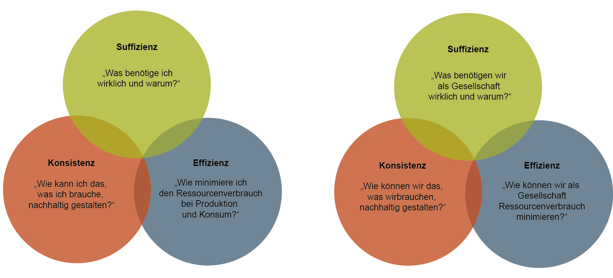
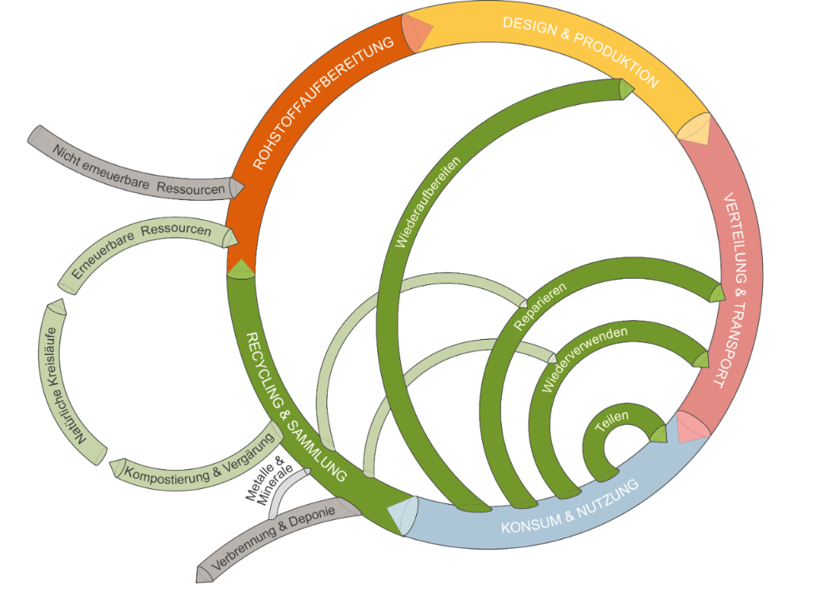

::: {.callout-note .guiding-question}
#### Guiding question

In Chapter 3, we saw why our economy fails to achieve its goal -- prosperity for all, within ecological limits. What fundamental levers are there to change this?
:::

In view of the ecological limits of our planet, most highly industrialized countries share a broad scientific and political consensus that ecological limits (planetary boundaries) should be respected in the long term. The 1.5-degree and 2-degree targets, a central climate policy goal, have also been enshrined internationally in the [Paris Agreement](https://www.fedlex.admin.ch/eli/fga/2017/81/en), which Switzerland has signed. With regard to economic and social limits, too, the global community has committed itself through the [2030 Agenda](https://sdgs.un.org/2030agenda), and Switzerland specifically through the goals of the [Sustainable Development Strategy 2030](https://www.are.admin.ch/are/en/home/sustainable-development/strategy/sds.html). These goals require a fundamental transformation of how we do business within a few decades.

This raises the decisive question: *how* exactly should this transformation succeed? The sustainability debate discusses three fundamental strategies: **efficiency**, **consistency**, and **sufficiency**. Practically all approaches to sustainable development build on these three strategies, but they differ in how they weigh their interplay and prioritization. Ultimately, achieving the sustainability goals probably requires all three working together:

## Efficiency Strategy

The efficiency strategy aims to use fewer resources (raw materials and energy) than before when manufacturing products or providing services, without reducing the quantity produced. This includes minimizing material consumption (material intensity), energy consumption (energy intensity), and the emission of harmful substances such as CO~2~. This concept is often called **eco-efficiency**. Business and society regard it as promising because it can reduce costs, resource consumption, and environmental impacts. The efficiency strategy starts on the production side, where change is sought primarily through technological progress. Proponents of this approach believe it is possible to double prosperity while halving the use of nature [@weizsaeckerFaktorVierDoppelter1997]. Critics of the efficiency strategy are less optimistic, however, and warn against overestimating its effects on sustainable economic activity. They point to so-called *rebound effects* (see Chapter 3.1.3, *Climate crisis -- market failure or systemic problem*), which can cause the gains from efficiency improvements to be smaller or even cancelled out [@paechBefreiungVomUberfluss2012; @santariusReboundEffektUberUnerwunschten2014].

::: {.callout-tip collapse="true"}
#### Examples of the efficiency strategy

- **Energy-efficient lighting**: Replacing conventional incandescent bulbs with energy-efficient LED lamps reduces electricity consumption and helps to lower energy demand.
- **Fuel-efficient vehicles**: Developing hybrid or electric vehicles with improved fuel consumption reduces fuel demand and road-traffic emissions.
- **Efficient building technology**: Installing smart heating, ventilation, and air-conditioning systems in buildings helps to reduce the energy used for heating and cooling.
- **Efficient water use**: Using water-saving fittings and systems in households and industrial companies reduces water consumption and minimizes waste.
:::

## Consistency Strategy

The efficiency strategy is quantity-oriented -- less resource use for more output. By contrast, the consistency strategy seeks compatibility between nature and technology, aiming to use resources repeatedly rather than consuming them only once. This implies replacing materials, products, and technologies that often rely on fossil resources with ones that match natural material cycles and operate in harmony with natural processes [@pufeNachhaltigkeit2017]. This is often called **eco-effectiveness** and follows the "cradle to cradle" principle, in which products go from "cradle to cradle" instead of from "cradle to grave". The idea behind it is that in intelligent systems there is no waste, only products. This can happen in two ways: materials can either be biodegradable, as with shampoo free of synthetic ingredients, or they can be designed as "technical nutrients" that remain in the technical cycle. This means that a product at the end of its life does not end up in the bin but passes into a next cycle of use, for example by being upcycled. A computer casing, for instance, could be reused again and again or converted into a shelving system. The consistency strategy, too, starts on the production side. It is expected to offer great problem-solving potential, a wider reach, and more profound change than the efficiency strategy.

Nevertheless, the economy's material cycles cannot be achieved without losses of mass and energy, so absolute consistency remains an unattainable ideal. Even products that are 100% biodegradable consume energy in their production. Consistency is nonetheless understood as an impetus for industry to strive for this ideal and to reduce both resource consumption and emissions as far as possible.

::: {.callout-tip collapse="true"}
#### Examples of the consistency strategy

- **Renewable energy systems**: The transition from fossil fuels to renewable energy sources such as solar, wind, and hydropower ensures that energy is produced in harmony with the natural rhythms and cycles of the environment.
- **Electronics designed for circularity**: Electronic devices are designed so that they can be easily repaired, upgraded, and recycled, in order to minimize resource consumption and environmental impact.
- **Sustainable construction**: Buildings are constructed using sustainable materials that have low environmental impacts and can be reused or recycled at the end of their service life.
:::

## Sufficiency Strategy

Sufficiency questions the level of need for a good life and aims to reduce resource and energy consumption through lower demand for resource-intensive goods and services. It is often also translated as moderation or appropriateness. Sufficiency takes a critical view of the new needs created by technology and advertising in relation to limited natural resources. It fosters an understanding that we need not "chase after" every newly created need, and that needs can be satisfied without consumption. Unlike efficiency and consistency, sufficiency focuses on the consumption side, though not exclusively. It can be practised to different degrees and at different levels, from smaller changes in behaviour (sharing rather than buying) to substantial changes in how we live (giving up air travel). Although it begins at the individual level, sufficiency can be applied at various levels, including companies (sufficiency-oriented product design) and governments (sufficiency policy). Sufficiency thus asks what the right measure is: How much do we need for a good life? And what do we not need? The sufficiency strategy is the subject of a passionate and intensive debate [@sedlacekOekonomieGutUnd2012].

Critics consider the sufficiency strategy limited in its savings potential and its sociocultural resonance. They doubt that it can find broad acceptance. By contrast, proponents argue that the sufficiency strategy occupies an essential place in sustainability policy, especially where the efficiency and consistency strategies reach their limits.

::: {.callout-tip collapse="true"}
#### Examples of the sufficiency strategy

- **Sharing and communal use**: Platforms and initiatives for sharing objects, tools, or vehicles make it possible to use resources more efficiently and to reduce the number of products manufactured.
- **Plant-based diets**: Switching to a mainly plant-based diet reduces the demand for resources such as water and land compared with meat production.
- **Working-time reduction**: Reducing working time can lead to lower resource consumption, since less energy and fewer materials are needed to produce goods and services.
- **Local consumption**: Supporting local producers and markets helps to reduce transport distances and emissions.
:::

::: {.callout-note collapse="true"}
#### Further reading

To explore the sufficiency strategy in more depth, read the Denknetz article ["The New Debate on Sufficiency"](https://ilias.unibe.ch/go/file/3803485){target="_blank"} (in German).

:::
